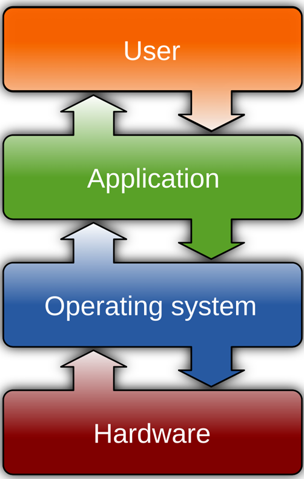
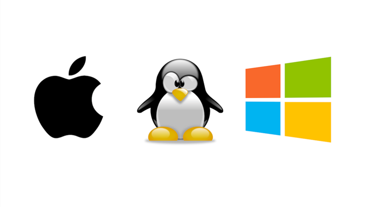
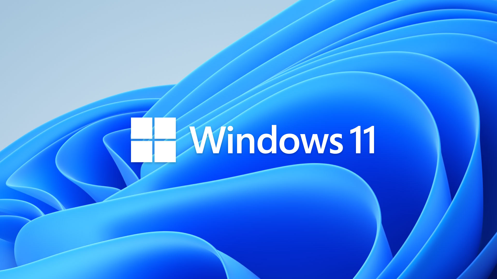
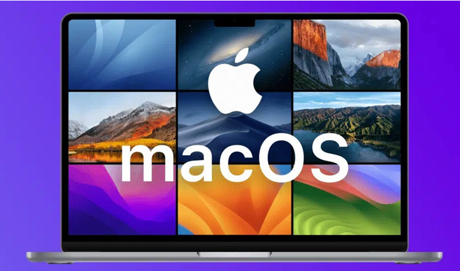
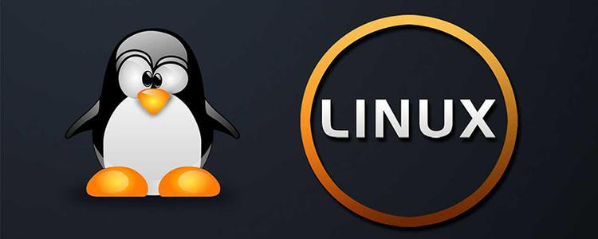

# 第一章 操作系统和Linux
## 1.什么是操作系统

### 1.1 操作系统的定义

<table style="width:100%;border:none;">
  <tr style="border:none;">
    <!-- 左侧文字区域 -->
    <td width="45%" style="border:none;vertical-align:top;">

- 操作系统（OS）是运行计算机硬件的核心程序，同时管理软件并协调用户与硬件之间的交互。它就像计算机的大脑，确保各项功能正常运作，使用户能够通过图形界面或命令与计算机沟通，而无需使用计算机本身的语言。没有操作系统，计算机将无法运行，是最重要的软件之一。  

- 操作系统的核心任务是管理计算机的所有软件和硬件。软件是指指导计算机完成特定任务的程序，如浏览网页或播放视频；硬件则是计算机的物理组成部分，包括CPU、内存、硬盘等。操作系统协调二者运行，确保程序高效使用硬件资源，使计算机顺利完成用户指令。  
    </td>
    <td width="55%" style="border:none;text-align:center;border:none;">

    </td>
  </tr>
</table>

### 1.2 操作系统的功能

<table style="width:100%;border:none;border-collapse:collapse;">
  <tr style="border:none;">
    <td width="48%" style="border:none;vertical-align:top;background:transparent;">

- 命令解释：翻译用户输入的指令；  
- 通信管理：协调软件资源；
- 设备管理：管理各种外部设备；
- 文件管理：管理文件的组织、命名、读取、共享和保护；
- 输入/输出管理：处理用户的输入和计算机的输出；
- 作业计费：记录每项任务或用户所耗费的时间和资源；
    </td>
    <td width="48%" style="border:none;vertical-align:top;background:transparent;margin-left:4%;">
- 内存管理：负责内存分配与释放；
- 网络管理：使不共享硬件或内存的处理器之间能够通信；
- 处理器管理：负责进程的创建、删除、同步与通信；
- 二级存储管理：管理数据在硬盘等长期存储设备中的存放；
- 安全管理：保护计算机中的数据不受恶意软件或非法访问的威胁。
    </td>
  </tr>
</table>

## 2.操作系统的发展历程

操作系统的进化是伴随硬件技术飞跃的，大致经历了六个时代：
1. 手工操作阶段（20世纪40年代末-50年代中期）

    状态：无操作系统。程序员通过插拔导线、拨动开关来运行程序。

    痛点：人机速度矛盾极大，计算机大部分时间在等待人工操作，效率极低。

2. 批处理系统阶段（20世纪50年代末-60年代中期）

    状态：出现单道批处理（一次一个任务）和多道批处理（内存中同时驻留多个程序，CPU在它们之间切换）。

    里程碑：解决了人工慢的问题，实现了作业的自动化“成批”处理。但此时交互性很差，用户无法干预运行中的程序。

3. 分时与实时系统阶段（20世纪60年代中期-70年代）

    分时系统：将CPU时间切成极短的“时间片”轮流转给多个终端用户。代表系统是Multics，它提出了“多用户、多任务”的现代操作系统雏形。

    实时系统：用于火箭、工业控制，要求系统在绝对规定时间内响应外部事件。

    重大事件：1969年，Unix操作系统在贝尔实验室诞生，它奠定了现代操作系统在安全、多任务、网络等方面的基石。

4. 个人电脑时代（20世纪80年代-90年代）

    状态：硬件成本降低，微处理器普及。

    标志性事件：

      - DOS（磁盘操作系统）成为早期IBM PC的标准。

      - Mac OS（1984年）率先推出成熟的图形用户界面（GUI），让电脑走向大众。

      - Windows 3.0/95（1990年代）凭借图形界面和兼容性，统治了个人桌面市场。

      - Linux内核（1991年，林纳斯·托瓦兹发布）诞生，作为开源的类Unix系统，迅速吸引全球开发者，成为日后国产系统的基石。

5. 网络化与移动时代（21世纪初-2010年代）

    状态：互联网和智能手机爆发。

    标志：

      - 服务器端Linux（如Red Hat、CentOS）成为Web服务器绝对主流。

      - 移动端iOS（2007年）和Android（2008年，基于Linux内核）重新定义了操作系统形态，使移动应用生态空前繁荣。

6. 万物互联与国产化崛起（2020年代至今）

    状态：云计算、AI大模型、物联网（IoT）和自主可控成为核心诉求。

    趋势：

      - 操作系统走向“分布式”和“轻量化”（如华为鸿蒙HarmonyOS）。

      - 国产操作系统迎来黄金期，正是在这个阶段，你之前提到的欧拉（服务器）、统信UOS/银河麒麟（桌面） 开始大规模替代CentOS和Windows，并深度适配国产芯片（龙芯、飞腾、鲲鹏）。

## 3.操作系统的类别
<!--常见系统介绍-->
日常最常接触到的操作系统：Microsoft Windows、macOS 和 Linux。

<!-- windows介绍 -->
<table style="width:100%;border:none;margin-bottom:40px;">
  <tr>
    <!-- 左侧文字 -->
    <td width="45%" style="border:none;vertical-align:top;">

- Microsoft Windows：诞生于 1980 年代中期，是最常见的操作系统，有多个版本可供使用。最近的版本是 2021 年发布的 Windows11。几乎所有的个人计算机（PC）都预装了 Windows，当然也有例外，最著名的就是苹果产品。Windows的功能相当多样化，并不断通过更新来提升安全性。
    </td>
    <!-- 右侧图片 -->
    <td width="55%" style="border:none;text-align:center;">

    </td>
  </tr>
</table>

<!-- macos介绍 -->
<table style="width:100%;border:none;margin-bottom:40px;">
  <tr>
    <!-- 左侧文字区域 -->
    <td width="45%" style="border:none;vertical-align:top;">

- Mac OS：这是安装在苹果电脑上的操作系统，全球使用率不到10%。它的界面看起来更为简洁时尚，但通常只能使用专有软件和硬件。总体而言，在这三种系统中，要充分发挥 macOS 的功能通常成本最高。macOS 的使用和自定义性相对受限，许多常见的程序、游戏和软件都不兼容该系统。不过，由于 macOS 被攻击的频率较低，因此安全性可能更好。
    </td>
    <td width="55%" style="border:none;text-align:center;">

    </td>
  </tr>
</table>

<!--Linux介绍-->
<table style="width:100%;border:none;">
  <tr>
    <!-- 左侧文字区域 -->
    <td width="45%" style="border:none;vertical-align:top;">

- Linux：与前两者不同，Linux 是开源的，任何人都可以对其进行修改并免费分发。这使得 Linux 在三者中限制最少，然而它在全球系统中的使用率不足 2% 。尽管如此，由于其高度的灵活性和可定制性，大多数服务器仍选择使用 Linux。
    </td>
    <td width="55%" style="border:none;text-align:center;">

    </td>
  </tr>
</table>

## 4.Linux简介

### 4.1 什么是Linux

Linux 是一种开源操作系统，可以被免费使用、修改和分发，因此有许多不同的“发行版”。它使用 C 语言开发，最初模仿 UNIX，如今广泛应用于手机、服务器、超级计算机等各种设备。

Linux 系统是由多个核心组件共同构成的，包括引导加载程序（bootloader）、内核（kernel）、初始化系统（init system）、守护进程（daemons）、图形服务器（graphical server）、桌面环境（desktop environment）和应用程序，这些部分协同工作，使整个操作系统能够正常运行。

- 引导加载程序（Bootloader）：
  是用于启动计算机的软件，它负责触发操作系统的运行。通常在开机时会出现一个短暂的启动画面，表示操作系统正在启动，该画面会在系统准备好后消失，启动速度取决于硬件性能。常见的引导加载程序包括 LILO（Linux Loader）、LOADLIN（Load Linux）和 GRUB（Grand UnifiedBootloader）。

- 内核（Kernel）：
  是操作系统的核心，负责管理和协调 CPU、内存（RAM）以及所有正在使用的外部设备。它是整个操作系统的基础，没有这个内核，设备就无法运行。

- 初始化系统（Init system）：
  用于引导或激活用户空间。最常见的初始化系统是 systemd。

- 守护进程（Daemons）：
  是在后台运行的多个服务，通常在启动过程中自动启动，或者在你登录桌面后启动。可以将守护进程视为后台任务，它们的名称通常以“d”结尾，比如 httpd 就是 Web 服务器的守护进程。

- 图形用户界面（GUI）：
  是一个子系统，负责将计算机的数据转换为显示在你所选显示器上的图形界面。在Linux 中，一个常用的 GUI 系统是 X Window 系统，通常简称为 X。

- 桌面环境（Desktop environment）：
  这是图形界面中用户可以实际进行交互的部分。根据个人偏好，有多种桌面环境可供选择，常见的包括 GNOME、Cinnamon、MATE、Unity 等。

- 应用程序（Applications）：
  就像你手机上的应用程序一样，是为了某个特定目的而下载的程序或软件。在 Linux上，几乎有无穷无尽的应用程序可以下载和使用，其中许多也适用于其他操作系统，例如 GIMP（图像编辑）、Discord（聊天）、Thunderbird（邮件处理）等。

### 4.2Linux的发展历程

#### 4.2.1从 Unix 到 Linux
- Linux 的诞生可以追溯到 Unix 系统的发展。Unix 最初由贝尔实验室基于 Multics 项目构建，后来由 Ken Thompson 和 Dennis Ritchie 用 C 语言重写，使其具有可移植性，广泛传播于商业和学术界，衍生出 BSD、NeXTStep、MINIX 等多个系统。

- Linux 深受 GNU 项目和 MINIX 系统影响：前者是 Richard Stallman 推出的开源替代方案，后者是 Linus Torvalds 开发 Linux 内核的起点。1994 年，Linux 内核正式发布，结合 GNU 工具（提供用户空间），形成如今广泛使用的 Linux 操作系统。

#### 4.2.2 起源与早期探索（1991-1994）
- 1991年：芬兰赫尔辛基大学的学生林纳斯·托瓦兹（Linus Torvalds） 在comp.os.minix新闻组上宣布，他正在编写一个免费的操作系统内核。同年10月5日，他发布了Linux 0.01版本。

- 思想源泉：Linux的诞生深受两个操作系统的影响：一个是用于教学的MINIX系统，另一个是强大但昂贵的Unix系统。同时，GNU计划提供的众多免费软件（如编译器GCC）为Linux的成长提供了必要的工具。

- 里程碑：1993年，Slackware诞生，它是第一个广泛成功的Linux发行版，至今仍在更新。1994年，Linux 1.0版本正式发布，代码量达到17万行，并采用了GPL（通用公共许可证） 协议，保证了其自由开放的特性。

#### 4.2.3 分化与走向成熟（1995-2005）
这一时期，Linux发行版开始分化，形成了几个主要的体系。

- Red Hat的崛起：1994年，Red Hat商业版Linux发布。随后，Red Hat Enterprise Linux (RHEL) 于2002年推出，定位企业级市场。2004年，社区免费版CentOS诞生，迅速成为服务器领域的主流。

- Debian与Ubuntu：Debian项目早在1993年就已启动，以其稳定性和对自由软件原则的坚守著称。2004年，基于Debian的Ubuntu发布，它以“对人类友好”为理念，凭借出色的易用性，迅速成为最流行的Linux桌面发行版之一。

- 其他重要分支：SUSE Linux于1994年发布，聚焦欧洲企业市场。

#### 4.2.4 云、移动与万物互联时代（2006至今）
Linux的应用场景空前扩展。

- 移动领域：基于Linux内核的Android系统占据了全球智能手机的绝大部分市场份额。

- 云计算与容器：轻量级发行版如Alpine Linux（约5MB）成为Docker镜像的首选基础。以CoreOS为代表的系统推动了“容器即服务”的理念。

- 国产操作系统崛起：在国家战略和产业需求的推动下，以欧拉（openEuler）、统信UOS、银河麒麟等为代表的国产Linux发行版蓬勃发展，尤其在CentOS停服后，迅速填补了企业级市场空白。

### 4.3.国外主流Linux发行版

二、各自定位、主要用途、代表发行版
1. Debian 系（主打桌面、开发、轻量化服务器、容器）

代表发行版：
Debian、Ubuntu、Linux Mint
设计理念：自由开源优先，软件更新快，易用性强，桌面生态完善
主要用途：

   - 个人桌面、办公电脑
    Ubuntu、Deepin、统信 UOS 桌面交互成熟，汉化完善，适合普通用户、程序员日常开发。
   - 开发机、容器 / 云开发环境
    Ubuntu 是 Docker、K8s、CI/CI 最主流镜像，软件新版本多，Python/Java/Node 等开发库齐全。
   - 边缘、嵌入式、单板机
    Debian 轻量分支适配树莓派、嵌入式网关，占用资源低。
   - 中小型轻量 Web 服务器、测试环境

优势：

   - apt 依赖自动解决能力极强，软件数量极多；
   - 桌面生态全，外设、影音、办公软件适配好；
   - 免费开源无订阅门槛，社区庞大。

短板：
企业级长期安全支持弱，金融、电信核心生产集群很少用 Debian 系。

2. RedHat 系（主打企业生产服务器、信创云、数据库）

代表发行版：
RHEL、CentOS、Rocky Linux、Fedora
设计理念：稳定优先、企业安全合规、长期支持、适合关键业务
主要用途：

   - 政企核心业务服务器
    数据库、中间件、支付系统、政务云、电力、金融核心集群国内几乎全是 RHEL 兼容系（Anolis、麒麟欧拉）。
   - 公有云、私有云、K8s 生产集群
    CentOS 停服后 Anolis、openEuler 成为国内云主力。
   - 国产化信创服务器底座
    openEuler、银河麒麟基于 RPM 体系，适配鲲鹏、飞腾、海光、龙芯全架构。
   - 传统 IDC、线下机房、大型 ERP 业务

优势：

   - 10 年长期安全维护，内核稳定、漏洞补丁响应快；
   - 安全标准完善，等保、军工、金融合规认证齐全；
   - 运维标准化程度高，国内运维人员基数最大。

短板：
软件版本偏保守，新版软件获取麻烦；桌面体验差，不适合家用。

3. SUSE 系（企业高端服务器、SAP、工业、欧洲市场）

代表发行版：
SLES（SUSE Linux Enterprise Server，商业收费）、openSUSE（社区免费）
设计理念：一体化图形管理 YaST、高可用集群、SAP 深度适配、欧洲政企主流
主要用途：

   - SAP ERP / 数据库专用服务器
    SAP 官方首选认证系统，全球大型企业 SAP 业务几乎标配 SLES。
   - 高可用集群、存储、虚拟化大型机房
    自带成熟 HA、集群、磁盘管理工具，灾备能力强。
   - 欧洲政企、制造业、工业服务器
   - openSUSE 用于个人桌面、开发者测试

优势：

   - YaST 一站式图形工具，网络、软件、服务、分区全图形管理；
   - 高可用、存储、虚拟化原生优化；
   - SAP 深度适配，企业商业支持完善。

短板：
国内市场占有率低，国内软件适配少；zypper 国内镜像源少，运维人才储备不足。

4. 一些核心区别

1） 包体系不互通

   - deb 软件不能直接装在 RPM/SUSE 系统；
   - RHEL 的 rpm 和 SUSE 的 rpm 内部打包规范不同，互相安装会大量依赖报错。

2）更新策略差异

   - Debian/Ubuntu：滚动 / 半年更新，软件版本新，适合开发、桌面；
   - RHEL/Anolis/openEuler：保守稳定版，只修复漏洞，不升级大版本，适合生产业务；
   - SLES：企业版锁定版本，稳定优先，openSUSE Tumbleweed 滚动更新。