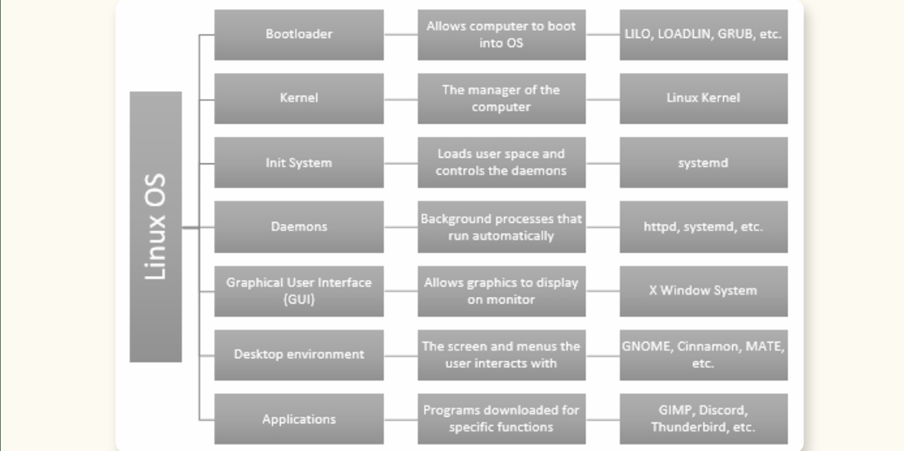
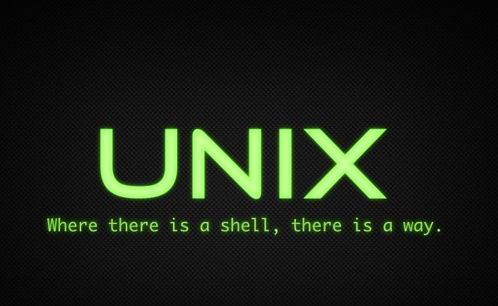
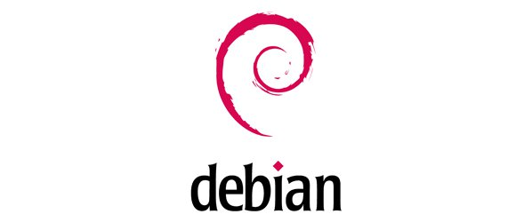
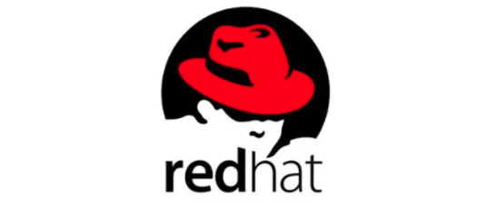
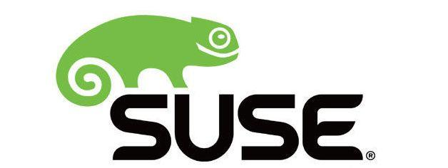

# 第二章 Linux简介

## 1.什么是Linux

Linux 是一种开源操作系统，可以被免费使用、修改和分发，因此有许多不同的“发行版”。它使用 C 语言开发，最初模仿 UNIX，如今广泛应用于手机、服务器、超级计算机等各种设备。

Linux 系统是由多个核心组件共同构成的，包括引导加载程序（bootloader）、内核（kernel）、初始化系统（init system）、守护进程（daemons）、图形服务器（graphical server）、桌面环境（desktop environment）和应用程序，这些部分协同工作，使整个操作系统能够正常运行。

- 引导加载程序（Bootloader）：
  是用于启动计算机的软件，它负责触发操作系统的运行。通常在开机时会出现一个短暂的启动画面，表示操作系统正在启动，该画面会在系统准备好后消失，启动速度取决于硬件性能。常见的引导加载程序包括 LILO（Linux Loader）、LOADLIN（Load Linux）和 GRUB（Grand UnifiedBootloader）。

- 内核（Kernel）：
  是操作系统的核心，负责管理和协调 CPU、内存（RAM）以及所有正在使用的外部设备。它是整个操作系统的基础，没有这个内核，设备就无法运行。

- 初始化系统（Init system）：
  用于引导或激活用户空间。最常见的初始化系统是 systemd。

- 守护进程（Daemons）：
  是在后台运行的多个服务，通常在启动过程中自动启动，或者在你登录桌面后启动。可以将守护进程视为后台任务，它们的名称通常以“d”结尾，比如 httpd 就是 Web 服务器的守护进程。

- 图形用户界面（GUI）：
  是一个子系统，负责将计算机的数据转换为显示在你所选显示器上的图形界面。在Linux 中，一个常用的 GUI 系统是 X Window 系统，通常简称为 X。

- 桌面环境（Desktop environment）：
  这是图形界面中用户可以实际进行交互的部分。根据个人偏好，有多种桌面环境可供选择，常见的包括 GNOME、Cinnamon、MATE、Unity 等。

- 应用程序（Applications）：
  就像你手机上的应用程序一样，是为了某个特定目的而下载的程序或软件。在 Linux上，几乎有无穷无尽的应用程序可以下载和使用，其中许多也适用于其他操作系统，例如 GIMP（图像编辑）、Discord（聊天）、Thunderbird（邮件处理）等。

## 2.Linux的发展历程

### 2.1从 Unix 到 Linux
- Linux 的诞生可以追溯到 Unix 系统的发展。Unix 最初由贝尔实验室基于 Multics 项目构建，后来由 Ken Thompson 和 Dennis Ritchie 用 C 语言重写，使其具有可移植性，广泛传播于商业和学术界，衍生出 BSD、NeXTStep、MINIX 等多个系统。

- Linux 深受 GNU 项目和 MINIX 系统影响：前者是 Richard Stallman 推出的开源替代方案，后者是 Linus Torvalds 开发 Linux 内核的起点。1994 年，Linux 内核正式发布，结合 GNU 工具（提供用户空间），形成如今广泛使用的 Linux 操作系统。

### 2.2 起源与早期探索（1991-1994）
- 1991年：芬兰赫尔辛基大学的学生林纳斯·托瓦兹（Linus Torvalds） 在comp.os.minix新闻组上宣布，他正在编写一个免费的操作系统内核。同年10月5日，他发布了Linux 0.01版本。

- 思想源泉：Linux的诞生深受两个操作系统的影响：一个是用于教学的MINIX系统，另一个是强大但昂贵的Unix系统。同时，GNU计划提供的众多免费软件（如编译器GCC）为Linux的成长提供了必要的工具。

- 里程碑：1993年，Slackware诞生，它是第一个广泛成功的Linux发行版，至今仍在更新。1994年，Linux 1.0版本正式发布，代码量达到17万行，并采用了GPL（通用公共许可证） 协议，保证了其自由开放的特性。

### 2.3 分化与走向成熟（1995-2005）
这一时期，Linux发行版开始分化，形成了几个主要的体系。

- Red Hat的崛起：1994年，Red Hat商业版Linux发布。随后，Red Hat Enterprise Linux (RHEL) 于2002年推出，定位企业级市场。2004年，社区免费版CentOS诞生，迅速成为服务器领域的主流。

- Debian与Ubuntu：Debian项目早在1993年就已启动，以其稳定性和对自由软件原则的坚守著称。2004年，基于Debian的Ubuntu发布，它以“对人类友好”为理念，凭借出色的易用性，迅速成为最流行的Linux桌面发行版之一。

- 其他重要分支：SUSE Linux于1994年发布，聚焦欧洲企业市场。

### 2.4 云、移动与万物互联时代（2006至今）
Linux的应用场景空前扩展。

- 移动领域：基于Linux内核的Android系统占据了全球智能手机的绝大部分市场份额。

- 云计算与容器：轻量级发行版如Alpine Linux（约5MB）成为Docker镜像的首选基础。以CoreOS为代表的系统推动了“容器即服务”的理念。

- 国产操作系统崛起：在国家战略和产业需求的推动下，以欧拉（openEuler）、统信UOS、银河麒麟等为代表的国产Linux发行版蓬勃发展，尤其在CentOS停服后，迅速填补了企业级市场空白。

## 3.国外主流Linux发行版

1. Debian 家族：社区驱动，稳定至上

    - **Debian**：历史最悠久的社区驱动发行版之一，以极致的稳定性和对自由软件原则的严格遵守而闻名。它是许多其他发行版（如Ubuntu）的上游基础。采用APT包管理系统。

    - **Ubuntu**：最流行的Linux发行版之一，基于Debian，由Canonical公司维护。以出色的易用性和友好的桌面体验著称。提供规律的长期支持（LTS）版本，在个人桌面和云平台（如AWS、Azure）中应用广泛。适合新手入门、日常桌面使用和云端部署。

    - **Linux Mint**：基于Ubuntu，进一步优化了桌面体验，被许多用户认为是最友好的桌面发行版之一。

2. Red Hat 家族：企业级市场的标杆

   - **Red Hat Enterprise Linux (RHEL)**：企业级Linux市场的领导者，提供长达10年的商业支持与认证。稳定性和安全性极高，是金融、电信等关键行业的标准选择。采用YUM/DNF包管理系统。

   - **Fedora**：由Red Hat赞助的社区项目，作为RHEL的前沿技术试验田，集成最新的开源软件。发布周期短，更新频繁，适合开发者和技术爱好者追求最新技术。

   - **CentOS / Rocky Linux / AlmaLinux**：这三者都是RHEL的免费克隆版，旨在提供与RHEL高度兼容的稳定企业级操作系统。在CentOS 8于2021年停止维护并转向CentOS Stream后，Rocky Linux（由CentOS创始人发起）和AlmaLinux成为了其热门的替代选择。

3. SUSE 家族：欧洲的精密之选

    - **SUSE Linux Enterprise (SLES)**：源自欧洲的成熟企业级发行版，在SAP等大型企业应用中积淀深厚。其独有的YaST图形化配置工具能大大简化系统管理。

    - **openSUSE**：SUSE的社区版本，提供Leap（稳定版） 和Tumbleweed（滚动更新版） 两个分支，平衡了稳定性与软件的新鲜度。

Debian、RHEL与SUSE优缺点对比

|特性维度|Debian (社区驱动)|Red Hat (RHEL) (商业标准)|SUSE (SLES) (专业均衡)|
| ---- | ---- | ---- | ---- |
|核心定位|追求极致稳定与开源自由的"通用操作系统"|企业级Linux的市场标杆，关键业务的首选|企业级Linux的强劲对手，尤其在欧洲和特定行业|
|包管理|DEB / APT|RPM / YUM / DNF|RPM / Zypper|
|优势|1. 坚如磐石的稳定性：软件包审核严格，极其可靠 2. 完全免费与开源纯粹：严格遵循开源理念 3. 架构支持广泛：支持从x86到ARM等多种处理器架构 4. 海量软件仓库：拥有最丰富的开源软件库之一|1. 顶级商业支持：提供SLA保障和专业服务 2. 超长生命周期：每个主要版本提供长达10年的支持 3. 极致稳定与安全：经过众多关键行业验证 4. 生态认证丰富：软硬件兼容性认证广泛|1. 强大的管理工具(YaST)：提供集成的图形化管理界面，简化复杂配置 2. SAP优化：是SAP HANA的官方推荐平台 3. 高可用性：在集群和容灾方面技术领先 4. 大型主机支持：对IBM大型机有独特支持|
|劣势|1. 软件版本较旧：为保持稳定，Stable分支软件通常较旧 2. 商业支持分散：缺乏统一强大的商业支持体系 3. 上手门槛较高：配置相对复杂，对新手不友好|1. 成本高昂：需要付费订阅，价格不菲 2. 自由度受限：受商业策略影响，核心是产品而非社区项目。|1. 成本较高：同样是付费订阅的商业发行版 2. 市场占有率：在北美和亚洲的市场份额不及RHEL 3. 管理工具评价不一：YaST虽有特色，但部分用户认为其GUI有待改进。|

## 4.国内主流Linux发行版

目前，国内市场已形成一个分层清晰、定位明确的生态系统，主要侧重于以下几个方面：

### 4.1 服务器与云操作系统

这一领域是国产操作系统的核心战场，主要面向数据中心、云计算等后端场景。

   - **openEuler（欧拉）**：定位为数字基础设施的底座，由华为发起，现由开放原子开源基金会托管。它全面支持x86、ARM、RISC-V等主流芯片架构，并面向AI时代发布了全球首个超节点（SuperPoD）操作系统。预计2025年底累计装机量将突破1600万套。

   - **Anolis OS（龙蜥）**：定位为CentOS的平滑替代者和云原生专家，由阿里云牵头，龙蜥社区打造。它高度兼容RHEL/CentOS生态，支持企业“零代码修改”平滑迁移，并提供长达13年的长期支持。其装机量已突破1000万套，在国产服务器操作系统中占据近半数份额。

   - **OpenCloudOS**：由腾讯等发起，社区装机量已超1000万节点。

   - **麒麟信安 (Kylinsec OS)**：基于openEuler根社区构建的企业级OS，是面向关键基础设施（如电力、航天） 的“特种精锐”。它自2009年起深度参与国家电网建设，上线超20万套；在航天领域，支撑了从神舟十二号到二十二号的载人飞船发射任务。其系统可用性高达99.9999%，并是国内首家且连续8次通过等保四级认证的厂商。

### 4.2 桌面与通用操作系统

这一领域主要面向政企办公、个人消费等桌面端场景。

   - **银河麒麟 (KylinOS)**：桌面端的市场龙头，由中国电子（CEC）旗下的麒麟软件研发。它在党政、金融等核心领域拥有断层式领先优势，桌面端党政市场占有率约70%。其最新版本银河麒麟V11是国内首个基于Linux 6.6内核的商业版操作系统，并引入了“磐石架构”和AI能力。

   -  **统信UOS**：桌面端另一大核心力量，由统信软件基于深度（Deepin）社区开发。它以界面友好、生态丰富著称，致力于降低Windows用户的迁移成本。其软硬件生态适配数已突破1000万，是国内首个达到此规模的操作系统平台。

   - **deepin（深度操作系统）**：国际化的开源桌面系统，是统信UOS的上游社区版。它在2026年发布了deepin 25版本，深度融合了UOS AI能力。

   - **开放麒麟 (openKylin)**：中国首个桌面操作系统开发者平台，注重自主创新。

### 4.3 嵌入式与其他专用操作系统

这类系统面向工控、物联网等特定场景。

   - **中科方德**：支持x86架构及融合生态。

   - **凝思磐石**：专注于电力、工控等对稳定性要求极高的领域。

   - **OpenHarmony（鸿蒙）**：面向全场景的分布式操作系统，生态设备总量已突破11.9亿台。其HarmonyOS V1.0桌面版也已进入2026年安全可靠测评名单。

## 5.Linux的开源文化

### 5.1 如何理解Linux的开源精神

Linux的开源精神更像一套关于“数字世界如何协作”的完整世界观。如果用一句话概括，那就是：相信分享的力量，尊重劳动的价值，并让技术主权回归每一个使用者。

我们可以从五个维度来深入感受这种精神的内核：

1. 哲学基石：自由是权利，而非价格

  - “开源”的核心从来不是“零成本”，而是“可掌控”。自由软件运动所倡导的“四项自由”（运行、研究、修改、再分发），本质上是在捍卫用户对数字设备的主权。
  - 在Linux世界里，你不会被系统强制升级，不会被弹窗广告干扰，电脑不会在你不知情时“偷跑”程序。这种精神认为：用户应该是工具的主人，而不是被工具所奴役。

2. 协作模式：从“大教堂”走向“集市”

  这是开源精神最经典的实践隐喻（出自埃里克·雷蒙德的《大教堂与集市》）：

  - 大教堂（闭源）：由少数精英精心规划，封闭建造，外界看不到过程，只能等待竣工。

  - 集市（开源）：像嘈杂的菜市场，全球各地的开发者随时加入，各抒己见，频繁迭代。
  
  Linux的诞生和壮大证明了：只要工具和沟通到位，一个松散、开放的“集市”，往往能建造出比精心规划的“大教堂”更庞大、更稳固的系统。

3. 社区准则：Talk is cheap. Show me the code.

这句Linux之父林纳斯·托瓦兹的名言，是开源精神里最务实的处事法则。
在Linux社区：

  - 没有绝对权威：哪怕是核心维护者，也必须靠技术实力说话。

  - 结果导向：争论一百种方案，不如实际提交一份高质量的代码补丁。

  - 精英治理：贡献越大，话语权越大。
  
这种“凭实力服众”的氛围，过滤掉了大量无效社交，保留了最纯粹的技术生产力。

4. 商业态度：开放不等于排斥商业

开源精神在很多人看来很“理想化”，但它并不天真。它巧妙地将“代码共享”与“商业服务”分离开来：

  - 代码是免费的，但技术支持、咨询、定制化服务是收费的（Red Hat、SUSE、国内的麒麟信安都是成功范例）。

  - 这种精神允许“拿来主义”，但更鼓励“回馈主义”。商业公司使用开源代码赚了钱，GPL许可证要求它也必须把针对核心的改进回馈给社区。这种机制，让商业利益反哺了公共技术，形成了可持续发展的良性循环。

5. 人文情怀：为人类的“公共数字财产”添砖加瓦

Linux属于全人类。当你使用Linux时，你不仅是在消费，更是在继承一份数字遗产——从Unix时代的先驱，到林纳斯在1991年的那个深夜，再到今天无数不知名的维护者。

这种精神认为：核心的计算机技术不应被任何一家公司垄断，它是现代文明的公共基础设施。 就像电力管网和公路一样，操作系统应该由所有人共同维护，因为所有人都离不开它。

### 5.2 如何保障Linux的开源精神 —— GPL

#### 5.2.1 什么是GPL
GPL，全称 GNU通用公共许可证（GNU General Public License），是目前开源界最具影响力和保护力的法律授权协议。它由自由软件基金会（FSF）起草，旨在用法律手段捍卫软件的“自由”，而非仅仅强调“免费”。

#### 5.2.2 GPL的核心机制
要快速理解GPL，只需要抓住它的一个核心机制和两个基本原则：
1. **一个核心机制：Copyleft（著佐权 / 反版权）**

这是GPL的灵魂。传统版权（Copyright）说“保留所有权利”，而GPL的Copyleft说“保留必要权利，但必须传递自由”。

它的规则很简单：如果你修改了基于GPL协议的代码，并将其对外分发（Distribution），那么你的修改版本也必须使用同样的GPL协议公开源代码。

这常被形象地称为“传染性”或“链式反应”。它的目的不是限制你，而是确保软件的自由属性能像涟漪一样，传递给每一个下游用户，永远不被私有化吞没。

2. **两个基本原则**

  - 自由至上：GPL捍卫的是用户 “运行、研究、修改、再分发” 软件的权利（即四项基本自由）。它默认你拥有对代码的完全掌控权。

   - 分发的义务：GPL的义务是 “分发即生效”。如果你只是自己修改自己用（比如公司内部使用，不对外销售），你可以不公开代码；但只要你把软件卖出去或提供给外部使用，就必须连带公开源代码。

#### 5.2.3 主要的版本演进

1. GPLv2（1991年发布）：Linux内核目前采用的版本。它简洁有效，重点防止代码被闭源吞并。

2. GPLv3（2007年发布）：针对新技术迭代，增加了专利授权条款和反Tivo化条款（防止硬件厂商用技术锁限制用户修改后的系统启动），并处理了云服务场景的法律漏洞。

#### 5.2.4 与宽松许可证（如MIT/Apache）的区别

- MIT/Apache（宽松许可证）：你拿了我的代码，修改后可以闭源，甚至做成商业软件卖钱，只要保留版权声明即可（如Android的某些组件）。

- GPL（强保护许可证）：你拿了我的代码，修改后如果要发布，必须公开你的所有修改。
