# 第四章 Linux命令行基础

## 1.如何使用Linux

### 1.1 登录
按上一章的内容将虚拟机安装好之后，打开虚拟机会进入到命令行界面。
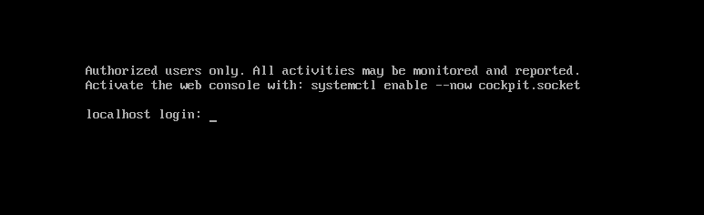

我们登录root用户

>注意：Linux系统中在命令行输入密码是不会显示的，直接输入然后回车即可。

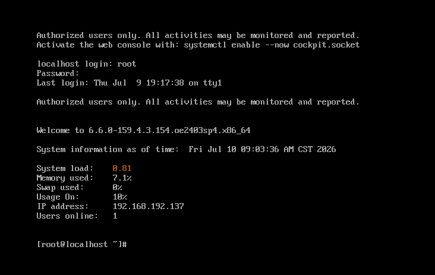
这里的[root@localhost ~]：
- root是登录的账号
- localhost是你的IP地址，这里就是主机
- ~ 是你目前所在的目录。

### 1.2 安装图形交互界面
相信用习惯了windows系统，第一次看到命令行界面会很不习惯吧。

这里就教大家如何安装图形交互系统，就像windows那样。

首先我们需要把系统里已经装好的所有软件、内核、系统补丁升级到软件源里的最新版本。

`dnf update -y`
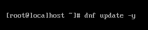
dnf是openeuler的软件管理器，后面会详细介绍

安装完成后会显示如下界面。
我们这里选择安装的是国产的 UKUI 桌面

`dnf install ukui-desktop-environment -y`
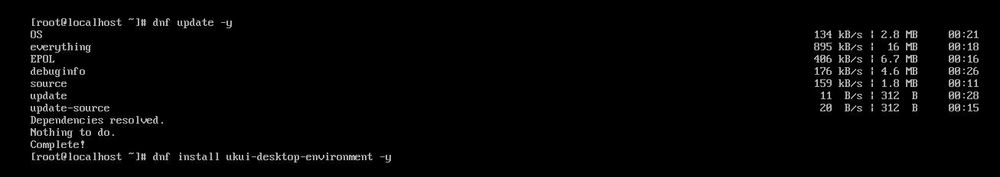

安装完成后输入
`systemctl set-default graphical.target`来设置默认图形启动
再`reboot`重启即可默认图形界面启动

需要注意的是，在图形界面是不能直接登录root账户的，要先登录其他账户
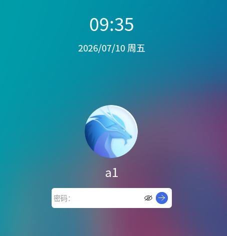

我们要如何在图形界面和命令行界面切换呢
其实Linux默认会提供六个终端tty1~tty6
【Ctrl + Alt +F1】 图形用户界面
【Ctrl + Alt +F2~F6】 命令行模式登录tty2~tty6终端

>注：如果打开图形界面分辨率过大，可以在开始界面->设置->系统->显示器中调整到合适的分辨率
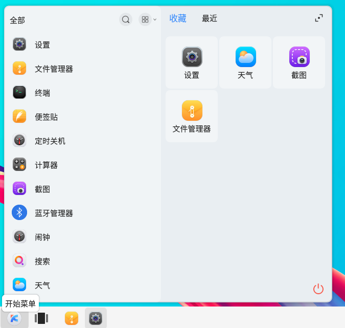
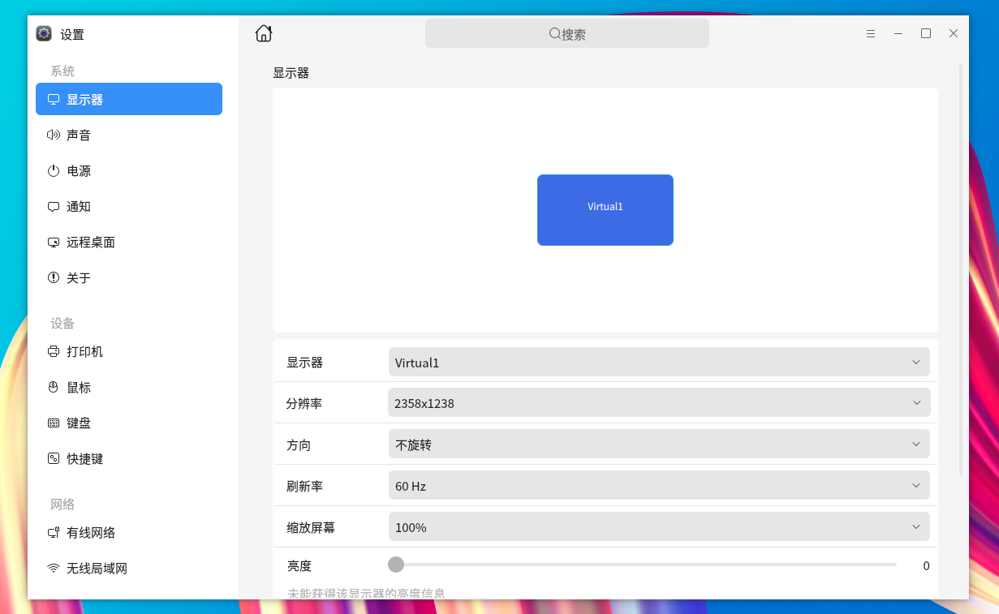

### 1.3 如何在图形交互界面打开命令行窗口

快捷键 `Ctrl + Alt + T`
或者右键，打开终端
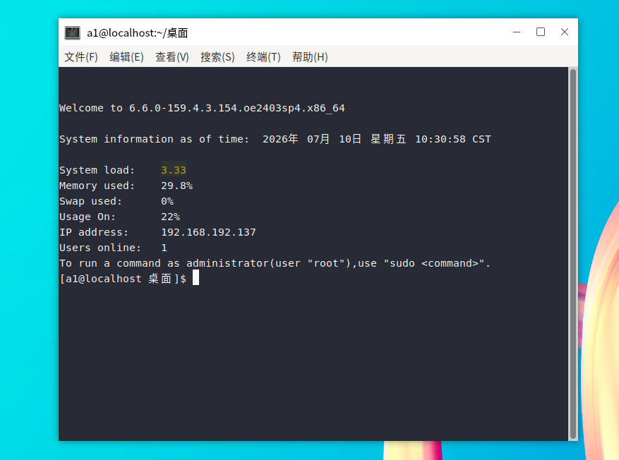

## 2.命令行基础

### 2.1 Shell概念
Shell 是用户和 Linux 内核之间的命令解释器，充当桥梁：接收用户输入指令，翻译给内核执行，内核执行结果再返回给用户。

openEuler 的默认 Shell是 bash（Bourne‑Again Shell），输入命令都是运行在 bash 里面。

Shell 的两个工作模式：

- 交互式 shell（日常使用）
    我们登录虚拟机后输入命令，输一条执行一条。
    例：
```bash
dnf install xxx -y
reboot
```

- 非交互式 Shell（Shell 脚本）
    把一堆命令写到 .sh 文件里，一次性批量运行。
    编写脚本文件，执行批量指令，自动化部署。

### 2.2 Linux文件层级

1. 蓝色：目录（文件夹）
2. 白色：普通文件（文本、配置文件）
3. 绿色：可执行文件（拥有x权限，可以运行）
4. 浅蓝色：软链接（快捷方式）；红色闪烁：无效软链接
5. 红色：压缩文件
6. 黑底黄色：硬件设备文件（/dev目录）

原理：颜色由环境变量 LS_COLORS 控制，配置文件/etc/DIR_COLORS。

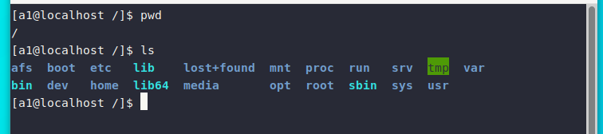

### 2.3 各目录介绍
1. **/（根目录）**
这是整个文件系统的最顶层根目录，所有内容都可以追溯到此目录。
只有 root（超级用户）才有权限在 / 目录下写入或编辑。你还会看到 /root，它是 root 用户的主目录。
注意，/root 与 /是不同的目录。

2. **/bin**
该目录包含在单用户模式下必须可用的一些基本命令的二进制文件（可执行文件）,如cat，cp，mv等。
这些文件以二进制格式存储。你还可以在这个目录中找到其他常见的 Linux 单用户模式命令

1. **/boot**
这是引导加载程序文件所在的位置。

1. **/dev**
这些是基本的设备文件，可能包括终端设备、连接到系统的设备或USB设备等。
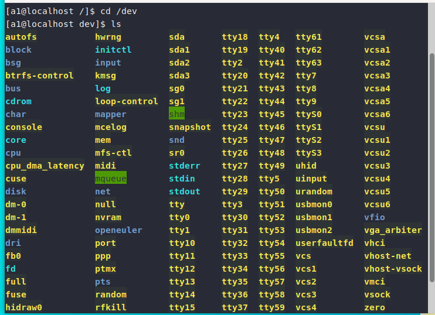

1. **/etc**
这些是主机特定但仍适用于整个系统的配置文件。你可以在这一目录中找到各种程序的配置文件，以及启动和关闭程序所需的启动和关闭Shell脚本。

1. **/home**
这是存放个人设置、你保存的文件以及用户主目录的地方。如果你下载并保存了某个文件，它很可能就在这里。通常会以你的用户名或计算机名的格式显示，如 /home/你的名字。

1. **/lib**
这是保存系统运行所需的函数库文件的地方，这些库文件是 /bin/ 和 /sbin/ 目录中可执行二进制文件正常运行所必需的。

1. **/media**
这是可移动介质的挂载点所在位置。通常你会在这里看到挂载介质的名称，比如插入光盘后会显示为 /media/cdrom，插入U盘后会显示为 /media/usb-drive。

1. **/opt**
这是用于可选应用软件的目录。这个目录包含附加的应用程序，通常会直接位于 /opt目录下，或者放在其子目录中。

1.  **/mnt**
这是用于临时挂载文件系统的目录。系统管理员可以在此目录下挂载临时文件系统。如挂载主机的共享文件夹。

1.  **/proc**
这是一个虚拟文件系统，用于存放进程和内核的相关信息。通常由系统自动生成，包含当前正在运行的进程信息等。

1.  **/sbin**
这是另一个用于存放可执行二进制文件的目录，不过 /sbin 中的文件通常由系统管理员用于系统维护相关的操作或命令，一般只有 root 或管理员需要用。

1.  **/tmp**
这是用于存放临时文件的目录，这些文件在系统关闭或重启后通常不会被保留。通常，此目录中的文件大小也会受到限制。

1.  **/srv**
代表“service（服务）”，/srv 用于存放与网络和服务器特定功能或服务相关的数据。

1.  **/usr**
这是只读用户数据的第二层目录结构，主要用于存放大多数用户工具和应用程序。像/目录的/bin、/sbin、/lib其实都是软链接，指向的就是/usr目录中对应的。
该目录下包含多个子目录，例如：
    - /usr/bin：用户程序的可执行二进制文件
    - /usr/sbin：系统管理员使用的可执行二进制文件
    - /usr/lib：为 /usr/bin 和 /usr/sbin 提供支持的库文件
    - /usr/local：用户从源代码安装的程序
    - /usr/src：Linux内核的源代码

### 2.4 如何创建共享文件夹

共享文件夹就是在主机创建一个文件，将它挂载到虚拟机里去。
这个文件夹里的文件，在虚拟机和主机里都可以使用和查看

首先需要安装vmware的官方工具
```bash
sudo dnf install open-vm-tools open-vm-tools-desktop -y
```

然后左上角虚拟机->设置->选项->共享文件夹
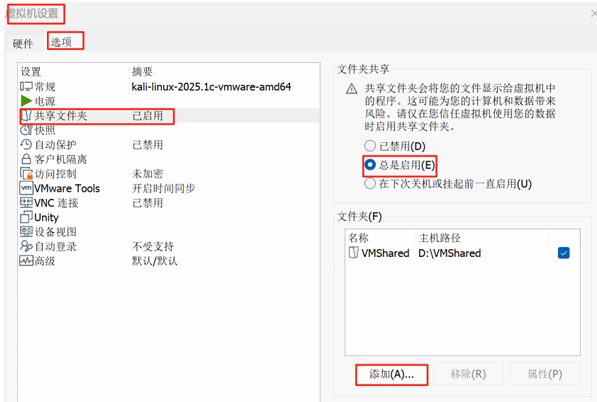
添加完成后就可以在虚拟机的`/mnt/hgfs`文件夹里看到共享文件夹了


## 3.基础命令介绍

1. `su -`
   我们是用a1用户登录的，可以看到命令行窗口我们的账号也是a1。
   想要切换到root用户，我们输入`su -`，然后输入root账号的密码
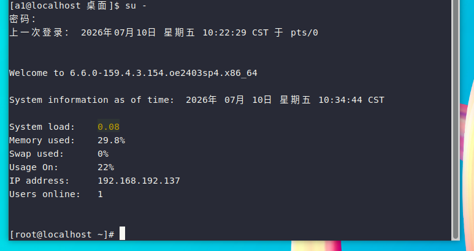
可以看到，此时已经切换到root用户

想要退出root用户，可以输入`exit`，或者使用快捷键 Ctrl + D

2. `sudo`
   如果不想切换到root用户，但是要使用的命令需要root权限。可以使用`sudo + 命令`的方式执行。
   sudo的意思就是以root用户身份执行命令。

3. `cd`
   cd是用来切换目录的。
   - 如果你要去的文件夹就在当前目录下，可以直接 cd + 名字，如：cd /mnt
   - 如果不在当前目录中，需要写完整路径，如：`cd /var/spool/mail`
   - 如果要去上层目录的文件夹，可以用相对路径，如：`cd ../postfix `
     这代表的就是从/var/spool/mail到/var/spool/postfix去
   - `cd ~` 表示回到家目录，即/root
   - `cd ..` 表示回到上层目录
   - `cd -` 表示回到刚才的目录

4. `pwd`
   显示目前所在的目录：

        [root@localhost ~]#  pwd
        /root


5. `ls`
   查看当前目录里的内容
   默认语法：ls  [选项]  [目录名]
    - 不加参数：`ls`，查看当前目录内容；
    - 指定目录：`ls /etc`，查看 /etc 目录内容。
    - `ls -l`:长格式显示，查看详细信息（权限、所有者、大小、时间、文件名）
    - `ls -a`：显示全部文件，包含隐藏文件（Linux 中以.开头的文件为隐藏文件）

6. `mkdir`
   建立新目录
   默认语法：mkdir [目录名]

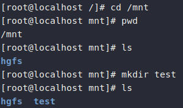

7. `nano`
   文件编辑器
     - 文件不存在：新建这个文件；
     - 文件已经存在：打开文件进行编辑。

8. `cat`
   查看文件内容，输出内容到终端

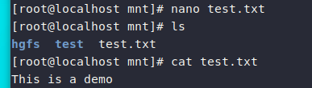
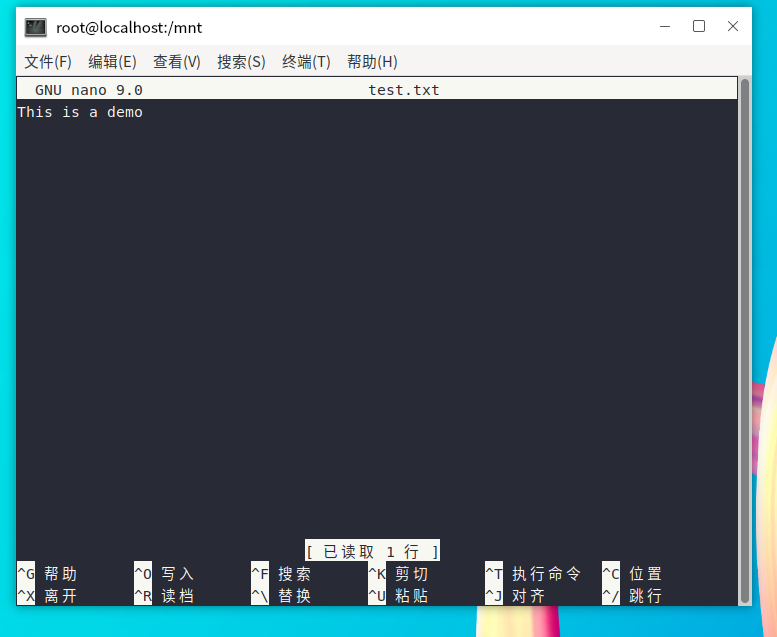

9. `cp`
    cp [选项] 源文件 目标位置
    - 复制文件
    `cp test.txt /home`
    把test.txt复制到/home目录

    - 复制文件夹
    `cp -r testdir /home`

    常用参数

        -r：复制目录必备；
        -i：覆盖前询问（y 覆盖，n 放弃）；
        -f：force 强制覆盖，不提示；cp -f。
    - 复制一份，名字改为test1.txt
    `cp test.txt test1.txt`
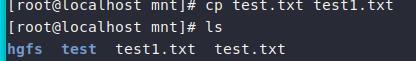

10. `mv`
    移动文件和文件夹
    mv [文件名/目录名] [目录名]
    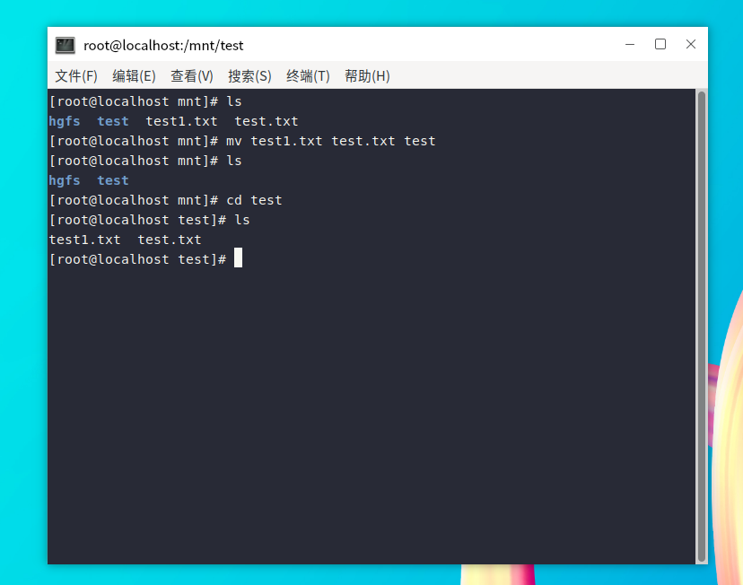

11. `rm`
    删除文件 rm [文件名]
    删除文件夹 rm -r [文件夹名]
    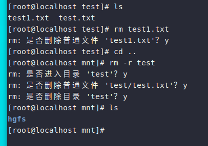

12. `touch`
    文件不存在：创建 0 字节空文件；
    文件已经存在：更新文件时间戳为当前时间。

## 4.快照
vmware还有一项重要功能就是拍摄快照
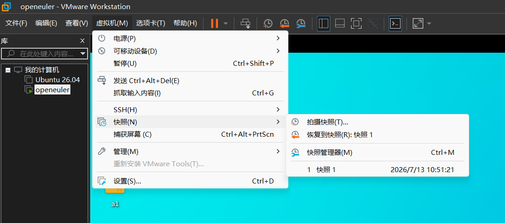

快照就相当于是将虚拟机目前的状态备份，以方便回退。

在进行一些危险操作之前可以拍摄一份快照。