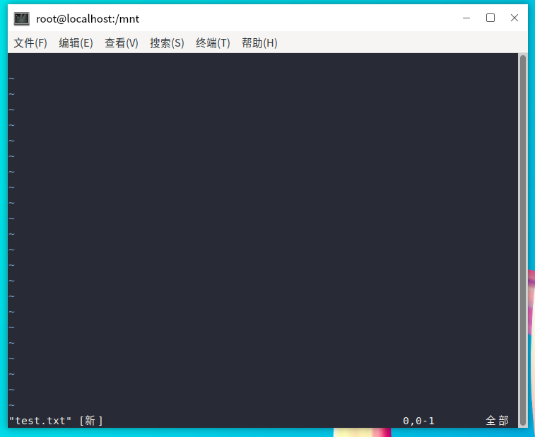
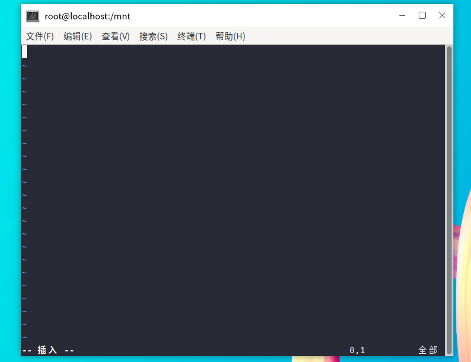
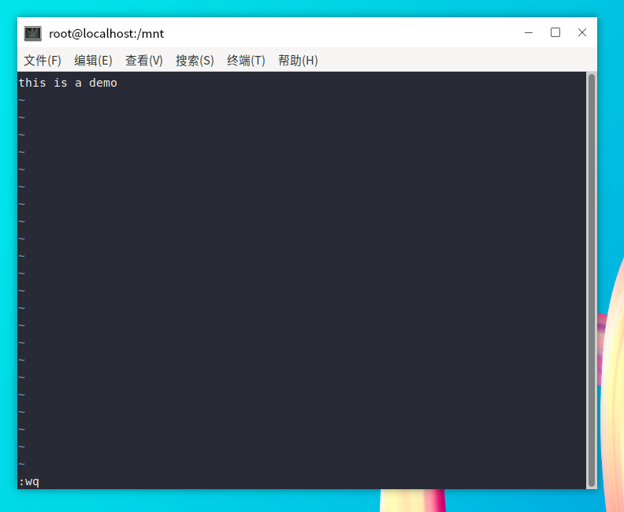
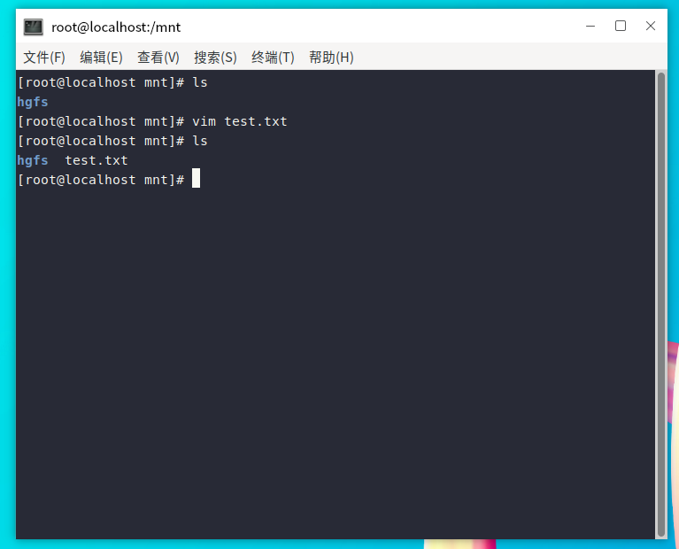

# 第五章 文本编辑器Vi/Vim

在上一章我已经介绍了一个文本编辑器nano，那为什么我们还要学习vi呢。
原因有以下几点：
- 所有的UNIX-like系统都会内置vi文本编辑器，其他文本编辑器不一定会存在
- 很多软件的编辑接口都会主动调用vi
- vim具有程序编辑的能力，可以主动的以字体颜色辨别语法的正确性，方便程序设计。
- 程序简单，编辑速度相当快速。
  
vim，可以视作是vi的进阶版本。简单来说，vi是老式的文本编辑器，功能很齐全，但还有进步的地方。而vim则是程序开发者的一项好用的工具。因为vim里加入了很多额外的功能，例如支持正则表达式的查找方式、多文件编辑、区块复制等。

## 1.vim的使用

### 1.1 模式

vim一共三种基础模式：
  - 一般命令模式（默认进入）：刚打开 vim 默认就是命令模式；只能敲命令，不能输入文字。
  - 编辑模式（插入模式）：按下 i 进入输入文字。进入编辑模式后，界面左下角会出现[INSERT]。
  - 命令行模式：命令模式输入 :，用来保存、退出、设置。

模式切换关系

    一般命令模式 → 插入模式：按 i
    插入模式 → 一般命令模式：按 Esc
    一般命令模式 → 命令行模式：输入 :
    命令行模式 → 一般命令模式：按 Esc

### 1.2 示例
vim + [文件名]
如果文件存在，则打开文件；如果文件不存在，就新建文件
下图是vim新建文件打开的样子，但这个时候我们是不能编辑文件的


按下i之后，可以看到左下角出现了-- 插入 --，这代表我们已经进入了编辑模式，可以在里面输入内容


输入完成后，按下esc，回到一般命令模式。再：wq保存并退出



### 1.3 常用按键说明
从一般命令模式切换到编辑模式的按键说明：

        i 与 I：进入插入模式。i是【从当前光标位置插入】，I是【在当前所在行的第一个非空格符处插入】
        a 与 A：进入插入模式。a是【从当前光标所在的下一个字符处开始插入】，A是【从光标所在行最后一个字符处开始插入】
        o 与 O：进入插入模式。o是【在当前光标所在的下一行插入新的一行】，O是【在当前光标所在的上一行插入新的一行】
        r 与 R：进入替换模式。r【只会替换光标所在的那一个字符一次】，R【会一直替换光标所在的字符，直到按下ESC为止】

ESC：退出编辑模式，回到一般命令模式。

一般命令模式切换到命令行模式的按键说明：

        :w 【将编辑的数据写入文件】
        :w! 【若文件属性为只读时，强行写入该文件】
        :q 【退出vim】
        :q! 【强制退出】
        :wq 【保存并退出】
        ZZ 【这里是大写Z，若文件没修改，则不保存退出；若文件已修改，则保存后退出】
        :set nu 【在每一行前显示行号】
        :set nonu 【取消行号】

## 2.可视区块

### 2.1 三种模式（命令模式下选择）

    v：字符可视模式，选中单个或者一部分字符；
    V（大写）：行可视模式，一次性选中整行；
    Ctrl+v：块可视模式（矩形区块），可以选中一块矩形区域。

    退出可视模式：按下Esc回到命令模式。

### 2.2 操作步骤
① 普通字符选择（小写 v）

    命令模式按 v；
    方向键上下左右移动选中文字；
    选中后：

    d 删除选中内容；
    y 复制选中内容；
    p 粘贴。

② 整行选择（大写 V）
按下 V，光标在哪一行就选中该行，上下箭头多选多行。
③ Ctrl+v 矩形区块（可视区块，考试高频）
Ctrl + v，可以选中一个矩形范围，不是整行，适合批量注释。
示例：批量在行首添加 #注释：

    Ctrl+v进入块选择；
    按方向键选中多行开头位置；
    按下大写 I；
    输入#；
    按 Esc，全部行前面自动添加 #。

删除批量注释：

    Ctrl+v选中每一行开头的#；
    按下d直接删除。


## 3.多文件编辑

### 3.1 开启方式
- 方式1：打开 vim 时一次性打开多个文件
```bash
vim file1.txt file2.txt
```

在命令行模式
:n 编辑下一个文件
:N 编辑上一个文件
:files 列出目前这个vim开启的所有文件

- 方式2：vim 内部再打开文件（命令行行模式）

```bash
:open 文件名
```

### 3.2 多窗口模式

首先用vim打开一个文件，在命令行模式输入

```bash
:split + 文件名  #打开一个新窗口（上下窗口）
:vsplit + 文件名 #打开一个新窗口（水平窗口）
```

在多窗口情况下的按键：

```bash
Ctrl + w + j/↓  #光标移到下方窗口
Ctrl + w + k/↑  #光标移到上方窗口
Ctrl + w + q    #相当于:q，结束退出
```

## 4.一般命令模式下的常用快捷键

      1. 数字<sapce>：按下空格后，光标会向右移动这一行的【数字】个字符。例如20<space>就是光标向右20个字符距离
      2. G ：移动到这个文件的最后一行
      3. 数字G ：移动到这个文件的第【数字】行
      4. gg ：移动到这个文件的第一行
      5. 数字<enter>：按下enter后，光标向下移动【数字】行
      6. dd ：删除光标所在的那一整行
      7. 数字dd ：删除光标所在的向下【数字】行
      8. yy ：复制光标所在的那一行
      9. 数字yy ：复制光标所在的向下【数字】行
      10. p与P ：p将已复制的数据粘贴在光标所在的下一行，P将数据粘贴在光标所在的上一行。
      11. u ：恢复前一个操作
      12. Ctrl + r ：重做上一个操作
      13. . ：这是小数点，意思是重复前一个操作