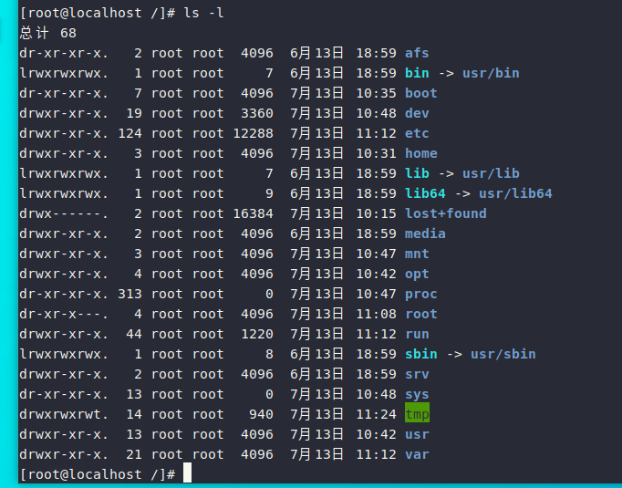
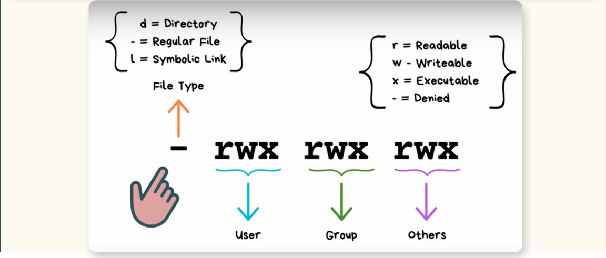
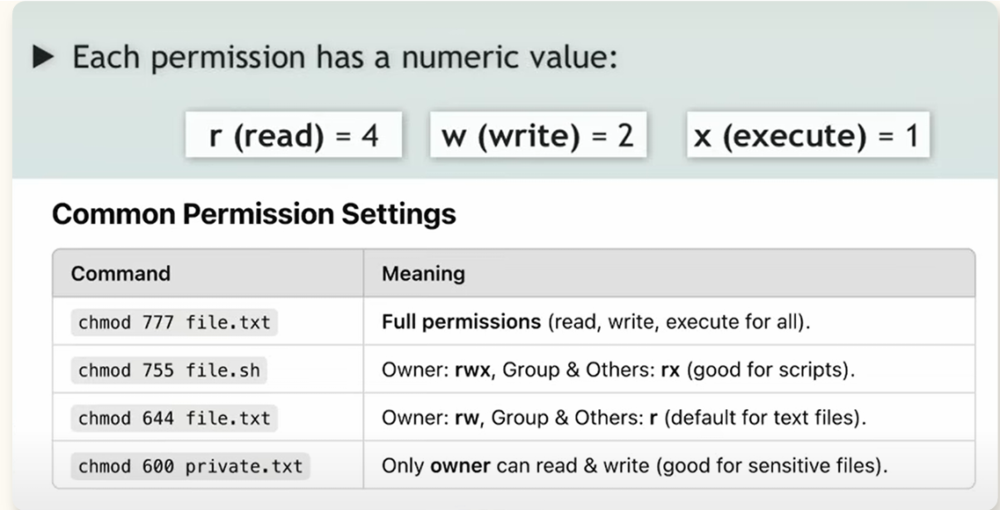

# 第六章 用户组与权限

## 1.用户与用户组

### 1.1 文件拥有者

由于Linux是个多人多任务的系统，因此可能会有多人同时使用这台主机来进行工作的情况发生，为了考虑每个人的隐私权以及每个人喜好的工作环境，文件拥有者的角色就很重要。

例如你有一个不想其他人看见的的文件，放在你自己的家目录。这时，你就该把该文件设置成“只有文件拥有者才能查看与修改这个文件的内容”。这样，即使其他人想看，由于你设置的权限，也无法查看。

### 1.2 用户组的概念

举例来说，现在有两组实习生在我的主机里面。第一个实习组是A，组员有1，2，3三个；第二个实习组是B，组员是4，5，6 。这两个组之间有竞争关系，但却要提交同一份报告。所以每组的组员必须要能够互相修改对方的文件，但是其他组的成员不能查看本组的内容。

在Linux中实现这样的限制很简单。通过文件权限的设置就可以让只有本用户组的人能查看并修改此文件，而其他用户组的人不能查看。同时，如果我还有私人文件，也可以设置成不让除自己以外的任何人查看。

### 1.3 用户和用户组的标识
    1.用户 (User)
    Linux 系统里每一个使用者就是用户；系统依靠 UID 区分用户。

    root 用户：超级管理员，UID=0，权限最高，可以做任何操作（对应 Windows 管理员）。
    普通用户：UID 默认从 1000 开始，权限受限。
    系统用户：供后台进程使用，一般不能登录系统，UID 1‑999。

    2.用户组 (Group)
    多个用户放入同一个组，依靠 GID 编号识别；用来统一设置权限。
    一个用户：
    - 必有初始组（私有组）；
    - 可以加入多个附加组。

### 1.4 核心配置文件

- /etc/passwd：存放所有用户信息（所有用户可读）
一行分为 7 段，用冒号隔开：
用户名:密码占位符:UID:GID:注释信息:家目录:登录Shell

- /etc/shadow：存放加密后的用户密码，只有 root 可以读取。

- /etc/group：保存用户组信息。

### 1.5 常用命令
1. 用户操作
   - 创建用户：`useradd 用户名`
   创建之后自动生成同名组作为初始组

   - 设置密码：`passwd 用户名`

   - 删除用户：`userdel -r 用户名`
   ‑r：同时删除家目录

2. 用户组操作
   - 创建组：groupadd 组名
   - 删除组：groupdel 组名
   - 将用户加入组：gpasswd -a 用户 组名

## 2.文件权限

Linux 每个文件/目录有三个权限主体：
1）所有者（owner / user）；
2）所属组（group）；
3）其他人（others）

### 2.1 权限结构
1. 第1位：文件类型（File Type）
- `d`：directory，目录（文件夹）
- `-`：regular file，普通文件（txt、sh程序文件）
- `l`：symbolic link，软链接（快捷方式）
拓展：还有`b`块设备、`c`字符设备。

2. 后面9位权限分为3组，每3位对应一类用户

| 分段位置 | 名称 | 含义 |
| ---- | ---- | ---- |
| 第2‑4位（前三位） | User（所有者） | 文件所属用户的权限 |
| 第5‑7位（中间三位） | Group（所属组） | 同组用户的权限 |
| 第8‑10位（最后三位） | Others（其他人） | 系统其余用户的权限 |

### 权限字符含义
- `r` = Read（读，数值4）
- `w` = Write（写，数值2）
- `x` = Execute（执行，数值1）
- `-` = Denied（没有该项权限）

示例：`-rwxr-xr-x`
1. `-`：普通文件；
2. `rwx`：所有者可读、可写、可执行；
3. `r-x`：所属组可读，不可写，可以执行；
4. `r-x`：其他人可读，不可写，可以执行

### 2.2 chmod指令
1. 权限赋值规则
- `r = 4`，`w = 2`，`x = 1`
每组3个权限相加得到1个数字，三组权限对应3位数字。
推导示例：
- `rwx`：4 + 2 + 1 = **7**
- `r-x`：4 + 0 + 1 = **5**
- `rw-`：4 + 2 + 0 = **6**
- `r--`：4 + 0 + 0 = **4**

2. 常用权限逐条解释
   
命令格式：`chmod 权限数字 文件名`，用来修改文件权限，只有root或文件所有者可以执行。
| 命令 | 含义 |
| ---- | ---- |
| `chmod 777 file.txt` | 所有者、组、其他人全部拥有读、写、执行权限，权限全开 |
| `chmod 755 file.sh` | 所有者 rwx；组和其他人 rx，脚本文件标准权限 |
| `chmod 644 file.txt` | 文件默认权限：所有者可读可写，组和其他人只能读取 |
| `chmod 600 private.txt` | 仅文件所有者读写，其他人完全无权限，适合私密文件 |

### 2.3 r、w、x 在文件和目录里的作用
1. **普通文件（-）**
- r：可以使用cat查看文件内容；
- w：可以修改、覆盖文件内容；
- x：可以运行shell脚本程序，`.sh`文件必须具备x权限才能执行。

2. **目录（d）**
- r：可以执行ls查看目录内的文件列表；
- w：可以在目录里新建、删除文件；
- x：可以cd进入目录（目录最重要权限，仅有r没有x无法进入文件夹

## 3.特殊权限
### 3.1 三个特殊权限总览
| 特殊位 | 数字值 | 作用对象 | 标识显示(ls‑l) |
|--------|--------|----------|----------------|
| SUID(Set‑UID) | 4 | 仅针对文件 | 所有者x位置：s（有x）、S（无x） |
| SGID(Set‑GID) | 2 | 文件、目录均可 | 组权限x位置：s（有x）、S（无x） |
| Sticky BIT粘滞位 | 1 | 仅针对目录 | 其他人x位置：t（有x）、T（无x） |

> 完整权限格式：`chmod 特殊位+普通权限`
示例：`chmod 4755 file`，4代表SUID，755是原来普通权限。

一、SUID（Set‑UID，数值4）
作用：
普通用户运行这个程序时，临时获得**文件所有者的身份**运行程序。
- 典型例子：`/usr/bin/passwd`
passwd程序所有者是root，普通用户执行passwd修改密码时临时拥有root权限，才可以修改`/etc/shadow`。
注意要点：
1. **只能作用于二进制可执行文件，对文件夹、shell脚本无效**；
2. 原来有x权限显示小写`s`；没有x权限显示大写`S`，代表特殊权限失效；
3. 安全问题：不要随意给程序设置SUID，容易提权入侵。
设置命令：
`chmod 4755 testfile`

二、 SGID（Set‑GID，数值 2）
分两种场景：
1）作用在可执行文件：运行程序时临时获得该文件所属组身份；
2）作用在目录（更加常用）：在该目录新建的文件，自动继承目录所属组。
    企业用途：多个协作用户加入同一个组，在这个文件夹创建文件自动归属本组，方便共享文件。
设置命令：
`chmod 2770 projectdir`

三、Sticky BIT（粘滞位，数值 1）
只对目录生效，文件无效；
开启粘滞位之后：文件夹里面的文件，只有文件所有者或者 root 才可以删除，其他人即使目录有 w 权限也不能删除别人的文件。
典型目录：/tmp临时目录，权限是1777。
设置命令：
`chmod 1777 /tmp`