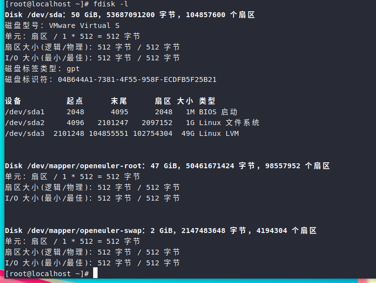

# 第八章 磁盘与文件系统

## 1.磁盘基础知识

### 1.1 磁盘设备命名规则

1. SATA、SAS、机械硬盘、普通 SSD：
    /dev/sda：第 1 块磁盘，sdb第 2 块磁盘，依次 sdc、sdd
    分区编号：/dev/sda1、/dev/sda2

>注：在虚拟机环境中可能会使用/dev/vda这样的设备名

2. 查看磁盘命令
```bash
    lsblk      #简洁查看磁盘和分区，优先使用
    fdisk -l   #查看分区详细信息
```

### 1.2 分区表

1）MBR 分区格式（老式）

限制条件：
        
- 最多只能有 4 个主分区；
- 如果想要更多分区：3 个主分区 +1 个扩展分区；扩展分区本身不能使用，只能再划分逻辑分区。
- 磁盘最大支持 2TiB；超过 2T 硬盘不能用 MBR；
- 配合 BIOS 启动；
- 分区工具：fdisk。

编号规则：
    主分区：sda1‑sda4；逻辑分区一定从 sda5 开始。

2）GPT 分区格式（现代主流）

特点：

- 最多 128 个分区，不用区分主分区、扩展分区、逻辑分区；
- 支持超大磁盘，远大于 2TB；搭配 UEFI 启动；
- 自带备份分区表，容错性更好；
- 分区工具：gdisk。


>我们的虚拟机用的就是GPT分区格式
## 2.分区实操

### 2.1 MBR 分区实操（fdisk /dev/sdb）
1. fdisk 交互内部指令
输入 fdisk /dev/sdb进入分区交互界面：

| 命令 | 作用 |
| --- | --- |
| m | 查看帮助 |
| n | 新建分区 |
| p | 打印分区列表 |
| t | 修改分区类型 ID（LVM、swap 分区要改） |
| d | 删除分区 |
| w | 保存分区表并退出 |
| q | 放弃修改并退出 |

2. 实操演示：创建主分区

- `fdisk /dev/sdb`
- 输入 n新建分区
    p：主分区 primary
    e：扩展分区 extended
- 分区号回车默认；起始扇区回车默认；设置结束扇区：+10G
- 输入 p 查看分区：/dev/sdb1
- 可选：修改分区类型
    默认类型是 Linux 文件系统（83）；
    如果用作 LVM 分区，分区 ID 改成8e；swap 分区 ID 是82。
- 输入w保存分区表。
- 系统识别新分区：

```bash
partprobe /dev/sdb
```
如果不执行 partprobe，内核识别不到刚划分出来的分区。

3. 创建扩展分区 + 逻辑分区
- n → e 创建扩展分区，把剩下全部空间给扩展分区；
- 再次 n，此时只能选择 logical 逻辑分区；
- 逻辑分区编号一定从 5 开始。

> MBR 弊端：
主分区最多 4 个；磁盘超过 2TB 不能识别；现在生产环境 GPT 越来越普遍


### 2.2 GPT 分区实操 gdisk /dev/sdb

- `gdisk /dev/sdb`
- 内部指令：

        n：新建分区；回车默认扇区；输入大小+20G；分区 GUID 默认 Linux‑filesystem；
        p：查看分区；
        t：修改分区类型；LVM 选8e00；swap 选8200；
        d：删除分区；
        w：保存。

GPT 里面不分主分区、扩展分区、逻辑分区，创建出来的分区都是普通分区。


### 2.3 分区之后必须做的两件事

分区只是在磁盘分区表里标记一段空间，此时分区仍然是裸设备，Linux 不能存放文件。

**步骤 1：格式化（创建文件系统）**
```bash
mkfs.xfs /dev/sdb1    #CentOS7之后默认文件系统
mkfs.ext4 /dev/sdb2
mkswap /dev/sdb3      #swap交换分区
```

**步骤 2：挂载分区**

1. 临时挂载重启失效：
```bash
mkdir /test
mount /dev/sdb1 /test
```

2. 永久挂载修改/etc/fstab

优先使用 UUID，blkid查看 UUID；磁盘顺序变动不受影响。
```bash
UUID="xxxx‑xx‑xx‑xx"   /test    xfs    defaults 0 0
```

执行 `mount -a` 检查配置，如果写错开机系统起不来。


### 2.4 分区类型 ID（t 命令修改）
分区 ID 只是标记用途，不改 ID 磁盘照样可以格式化使用，只是规范问题。
- 83：Linux 普通文件分区（默认）
- 82：swap 分区
- 8e (MBR) / 8e00 (GPT)：LVM 物理卷 PV 分区；生产环境做 LVM 时必须设置。

>注意：即使不修改分区 ID，pvcreate 照样可以把分区做成 PV，只是企业规范要求修改 ID。


### 2.5两种使用方式（分区之后两条路线）
方案 1：普通分区（直接格式化挂载）
`磁盘 → fdisk/gdisk 分区 → mkfs 格式化 → mount 挂载`。
缺点：后期扩容非常麻烦。磁盘空间分完之后很难调整大小。

方案 2：做成 LVM 逻辑卷（企业主流）
磁盘分区后，修改分区 ID 为 LVM 类型；
然后执行：`pvcreate → vgcreate → lvcreate → mkfs格式化挂载`。
好处：后期可以动态扩容，不用停机。


四层关系：磁盘分区 → PV → VG → LV → 文件系统。

### 2.6删除分区步骤
`fdisk /dev/sdb`输入 d，选择分区号删除；`w` 保存；
`partprobe` 刷新内核；
如果是 LVM 分区，还需要执行`pvremove`清理 LVM 标记。

## 3.Linux常见文件系统类型
### 3.1 xfs
- 使用版本：CentOS7、RHEL7及之后系统默认文件系统。
- 特点：日志型文件系统；适合大容量磁盘和大文件；LVM适配性优秀；**只支持扩容，不支持缩容**。
- 格式化命令：`mkfs.xfs /dev/sdb1`
- 扩容命令：`xfs_growfs 挂载目录`

### 3.2 ext4
- 使用版本：CentOS6、RHEL6默认文件系统。
- 特点：日志文件系统，稳定性极高；既可以扩容也支持缩容。
- 格式化：`mkfs.ext4 /dev/sdb2`
- 扩容：`resize2fs /dev/sdb2`。

### 3.3 swap（交换分区）
- 作用：虚拟内存。物理内存不足时，内核将内存的数据放到swap分区。
- 分区ID：MBR为82，GPT为8200。
- 命令：
    - `mkswap /dev/sdb3`：格式化swap
    - `swapon /dev/sdb3`：启用swap
    - `swapoff /dev/sdb3`：关闭swap

### 3.4 tmpfs
- 内存文件系统，数据存放在内存，断电数据丢失。
- 默认挂载点：`/dev/shm`，用来存放临时文件，读写速度极快。

### 3.5 btrfs
- 高级文件系统，自带快照、磁盘压缩、冗余。
- 生产环境使用较少。


##  4.LVM逻辑卷管理

### 4.1 LVM概述

普通分区缺点：划分完成后空间很难扩容缩容。
LVM（Logical Volume Manager）逻辑卷管理器，可以**在线动态扩容磁盘，业务不用停机**。

**四层组成结构（自上而下）**
磁盘分区 → PV（物理卷） → VG（卷组） → LV（逻辑卷） → 文件系统
1. **PV(Physical Volume)物理卷**
    将普通磁盘或者分区打上LVM标识，成为PV。
2. **VG(Volume Group)卷组**
    把多个PV整合为一个存储资源池；
    VG里面最小存储单元叫PE，默认大小4M。
3. **LV(Logical Volume)逻辑卷**
    从VG卷组中划分PE组成逻辑卷，就是我们实际使用的分区。
4. 文件系统：对LV格式化xfs或ext4之后挂载使用。

> 设备路径示例：`/dev/vg名称/lv名称`。

### 4.2 创建LVM整套命令
1）创建PV物理卷
```bash
pvcreate /dev/sdb1 /dev/sdc1
#查看pv
pvs
pvdisplay
```

2）创建 VG 卷组
```bash
vgcreate vg_data /dev/sdb1 /dev/sdc1
#查看vg
vgs
vgdisplay
#后期新增磁盘扩展VG
vgextend vg_data /dev/sdd1
```

3）创建 LV 逻辑卷
- `-L` 指定容量；`-n` 设置 Lv 名字
```bash
lvcreate -L 20G -n lv_data vg_data
#查看lv
lvs
lvdisplay
```

4）格式化并挂载
```bash
mkfs.xfs /dev/vg_data/lv_data
mkdir /lvmdata
mount /dev/vg_data/lv_data /lvmdata
#开机自启写入/etc/fstab
```

 
### 4.3 LV 扩容
情况 1：VG 里面还有剩余空间

1）扩充 LV 容量
```bash
lvextend -L +10G /dev/vg_data/lv_data
```

2）同步文件系统
```bash
#xfs文件系统：只能够扩容，不能缩容
xfs_growfs /lvmdata
#ext4文件系统
resize2fs /dev/vg_data/lv_data
```

情况 2：VG 空间不足
1. 新磁盘分区 → pvcreate 做成 PV；
2. vgextend把 pv 加入卷组；
3. lvextend扩大 lv；
4. 更新文件系统。

### 4.4 LV 缩容（谨慎操作）
>重点：xfs 文件系统不支持缩容，只有 ext4 可以缩容。

缩减顺序：卸载分区 → 磁盘检查 → 缩小文件系统 → 缩减 LV
```bash
umount /lvmdata
e2fsck -f /dev/vg_data/lv_data
resize2fs /dev/vg_data/lv_data 15G
lvreduce -L 15G /dev/vg_data/lv_data
mount /dev/vg_data/lv_data /lvmdata
```

### 4.5 删除 LVM（倒序操作）
顺序：卸载 → 删除 LV → 删除 VG → 删除 PV
```bash
umount /lvmdata
lvremove /dev/vg_data/lv_data
vgremove vg_data
pvremove /dev/sdb1 /dev/sdc1
```

### 4.6 查看 LVM 简要信息命令
```bash
pvs    #查看pv
vgs    #查看vg
lvs    #查看lv
```