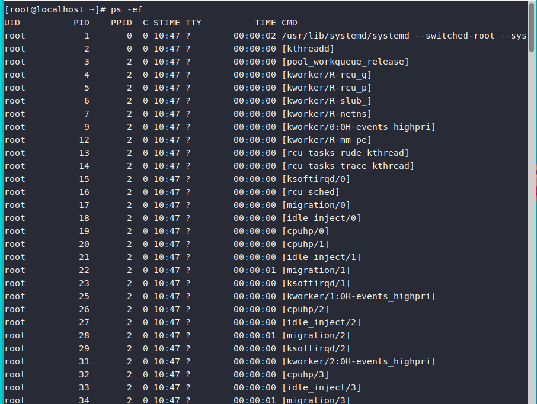
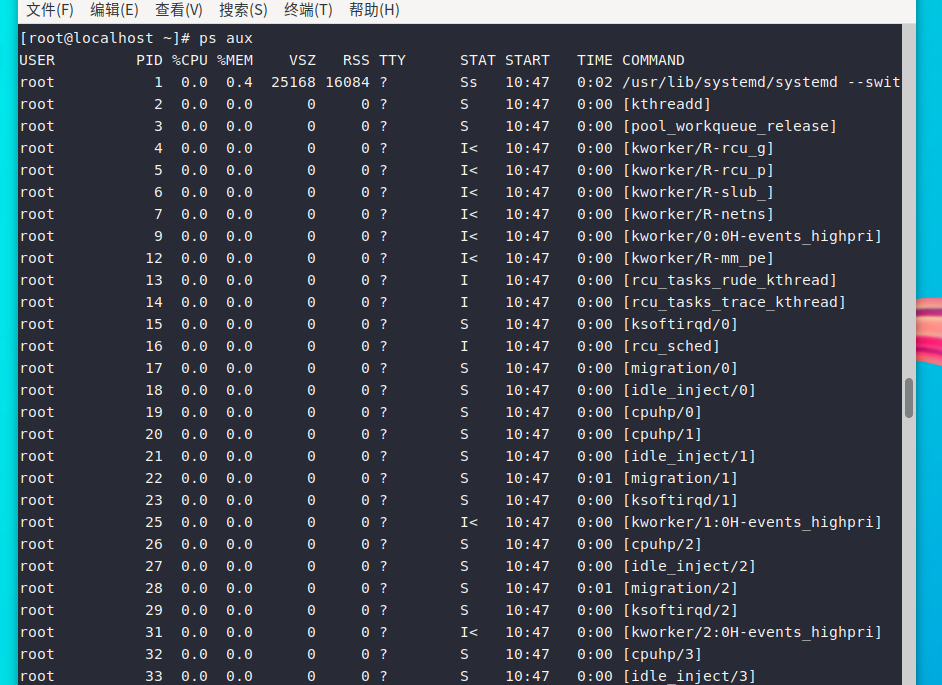
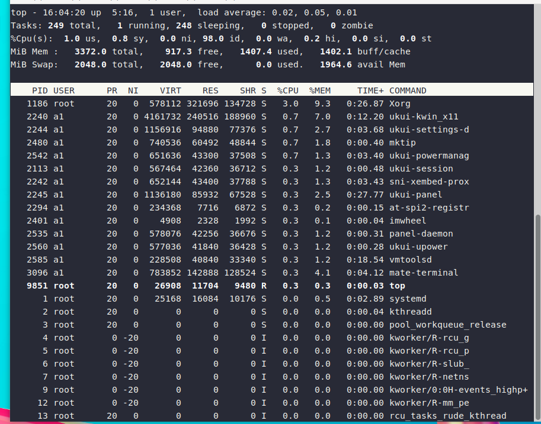
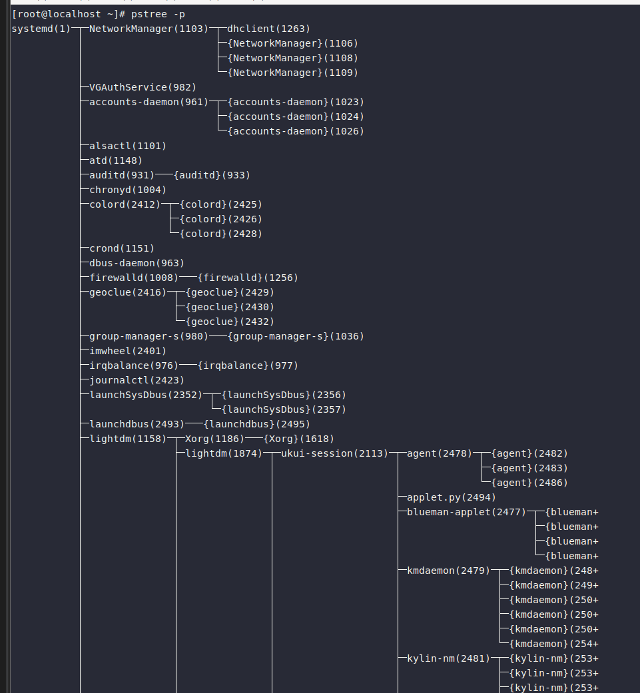
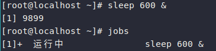
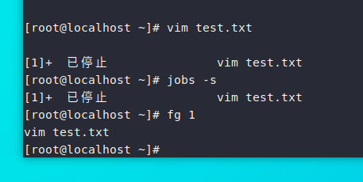

# 第九章 进程与服务管理

## 1.进程管理

### 1.1 基础概念

1. 进程（Process）：程序运行起来之后的实例；程序是磁盘上的静态文件，进程是内存中动态运行的。
2. PID：进程 ID，每个进程唯一编号；PPID代表父进程 ID，Linux 进程几乎都是由父进程创建。
3. 进程的诞生方式：
   - 系统先以fork方式复制一个与父进程相同的临时进程
   - 临时进程开始以exec的方式加载实际要执行的进程，最后变为子进程。
4. 1号进程：
    CentOS7+/openEuler：systemd（PID=1） 负责启动系统所有进程
    CentOS6：init
5. 进程状态

|状态符号|含义|
|---|---|
|R|运行态：正在 CPU 上运行或就绪等待 CPU|
|S|可中断睡眠：等待资源，可以被信号唤醒|
|D|不可中断睡眠（磁盘 IO 阻塞），kill 命令杀不掉|
|Z|僵尸进程：子进程结束，但父进程没有回收它的退出资源|
|T|停止状态，被暂停|

6. 前台进程 & 后台进程

   - 前台：占用终端，执行时不能敲命令；
   - 后台进程：脱离终端运行，末尾加&启动。


### 1.2 查看进程常用命令
1. ps（查看瞬间进程快照，静态）
常用组合：`ps -ef` 和 `ps aux`
1）`ps -ef`

2）`ps aux`（显示进程状态、CPU、内存占用）

   - % CPU：CPU 占用；% MEM 内存占比；
   - STAT 就是进程状态 (R/S/D/Z/T)。


筛选进程grep
```bash
ps -ef | grep nginx    #查看nginx进程
ps aux | grep -v grep  #排除grep自身进程
```

1. top（动态实时查看进程）
```bash
top
```
   - 第一行：系统时间、运行时长、登录用户数、平均负载（1 分钟、5 分钟、15 分钟）；

   - 经验：多核 CPU，平均负载≤CPU 核数为合理。

   - 第二行：进程总数、运行 R、睡眠 S、僵尸 Z、停止 T；
   - 第三行：CPU 整体占用：us 用户态，sy 内核态，id 空闲 CPU；
   - 第四行：物理内存；第五行 swap 交换分区；
   - 下面列表里重点：PID、USER、% CPU、% MEM、COMMAND。


快捷键：P：按 CPU 排序；M：按内存排序；q 退出。

升级版：htop（界面更友好，需要 yum 安装）。

3. pstree 树形查看进程父子关系
```bash
pstree -p    #-p同时显示PID
```


可以清晰看到谁创建了谁。

4. pgrep 只获取进程 PID
```bash
pgrep nginx
```

### 1.3 后台进程管理（只针对当前终端）

1. 命令放后台运行：命令 &
```bash
sleep 600 &
```

2. jobs查看当前终端后台任务
   
   `-l` ：除了列出job number与命令串之外，同时列出PID的号码
   `-r` ：仅列出正在后台run的任务
   `-s` ：仅列出正在后台当中暂停的任务
```bash
jobs
```


1. fg 编号：后台进程切回前台；bg 编号让暂停任务继续后台运行；

2. Ctrl + z：把前台进程暂停丢入后台（状态 T）。

   例子：如果我们正在vim，却发现有个文件不知道放哪里，需要到bash环境下执行查找，此时就可以用Ctrl + z，暂时将vim丢到后台。查找结束后用fg把vim从后台切回前台
   

>注意：jobs只对当前终端生效，关闭终端 jobs 进程就会结束；如果想要关闭终端程序继续运行要用nohup或screen。
```bash
nohup ./test.sh &
#输出日志默认放到 nohup.out，断开终端程序依旧运行
```

### 1.4进程终止：kill 命令（发送信号）
1. 常见信号（kill -l查看全部信号）
   
    - kill -15 PID（默认不加参数就是‑15）：正常终止，允许程序收尾保存数据，推荐优先使用。
    - kill -9 PID：强制杀死，暴力杀掉，进程来不及释放资源，万不得已才用；D 状态进程 -9也无效。

```bash
kill 1234          #优雅关闭
kill -9 1234       #强制杀死进程
killall nginx       #按进程名批量杀死所有nginx进程
pkill nginx        #找到所有名字含nginx的进程，默认发送‑15优雅关闭信号，正常停止nginx服务。
```

2. 僵尸进程处理办法
僵尸进程 Z 状态是子进程已经结束，父进程没有回收；

   - 期少量僵尸进程不用在意；
   - 大量僵尸进程：重启父进程或者杀死父进程，systemd 会接管回收子进程。

>D 状态进程：磁盘 IO 异常，杀掉无效，一般只能重启服务器解决。

### 1.5 守护进程
#### 1.5.1 什么是守护进程
守护进程（daemon）是长期在后台运行、无控制终端、不占用前台窗口的服务程序。
特点：

   - 脱离终端，关闭 SSH / 显示器不会终止；
   - 开机自动启动，持续提供服务（数据库、Nginx、防火墙、日志等）；
   - 标准输入 / 输出 / 错误全部重定向到日志，不打印到屏幕；
   - 父进程通常为 systemd（PID=1）。

举例：sshd、nginx、mysqld、firewalld、rsyslogd 都是守护进程，名字常以 d 结尾（daemon 缩写）。

#### 1.5.2 守护进程与普通前台程序区别
1. 前台程序

   - 绑定当前终端，终端关闭、Ctrl+C 直接杀死进程；
   - 输出打印到屏幕；
   - 父进程是当前 shell。

2. 守护进程

   - 脱离终端，关闭窗口不影响；
   - 日志输出到文件 /var/log/；
   - 由系统管理器（systemd）统一管理启停、自启、崩溃重启。

#### 1.5.3 传统守护进程生成步骤（手动编写 Daemon 原理）
如果自己写程序实现守护化，标准流程：

   - fork () 创建子进程，父进程退出
   - 脱离 shell 终端控制，shell 认为程序已执行完毕。
   - setsid () 创建新会话
   - 彻底脱离原终端会话，不再接收终端信号（SIGHUP 挂断信号）。
   - 再次 fork ()，子进程运行
   - 保证进程不再是会话首进程，无法重新打开终端。
   - 修改工作目录为 / 或 /var/lib
   - 防止占用挂载点，无法卸载磁盘。
   - 重设文件权限掩码 umask=0
   - 避免创建文件权限受限。
   - 重定向 0/1/2 文件描述符
   - stdin/stdout/stderr 指向 /dev/null 或日志文件，不再输出屏幕。

#### 1.5.4 现代 Linux：systemd 托管守护进程
现在 openEuler、CentOS、Debian、SUSE 全部使用 systemd 管理服务，不用手动写 daemon 逻辑，只需写 .service 单元文件。
1. 服务文件存放路径

   - 系统自带服务：/usr/lib/systemd/system/
   - 用户自定义服务：/etc/systemd/system/

2. 简单 service 模板（自定义守护进程）
`/etc/systemd/system/demo.service`
```ini

[Unit]
Description=自定义后台守护进程
After=network.target  # 网络启动后再运行

[Service]
Type=simple
ExecStart=/usr/bin/python3 /opt/demo.py
Restart=on-failure  # 程序崩溃自动重启
User=root
StandardOutput=file:/var/log/demo.log
StandardError=file:/var/log/demo.err

[Install]
WantedBy=multi-user.target  # 多用户模式开机自启
```


#### 1.5.5 临时后台进程（&）≠ 守护进程

`python test.py &`

加 & 只是放到后台，不是守护进程：

   - 关闭 SSH 终端会发送 SIGHUP 信号杀死程序；
   - 依赖终端会话。

## 2.服务管理

版本划分：
CentOS‑6：init 管理，命令：service、chkconfig，运行级别 0‑6；
CentOS‑7 向后：systemd，PID=1，统一命令 systemctl，现在主流。

### 2.1 CentOS6：传统 init（Sys‑V‑init）
1. 工作模式
    PID=1 进程是 /sbin/init，采用串行启动，一个服务启动完成之后才会启动下一个服务，开机速度慢。

1）运行级别（0‑6）
Sys‑init 依靠运行级别决定启动哪些服务：

    0：halt 关机
    1：单用户模式（root，不需要密码，修复系统）
    2：多用户无网络
    3：完整多用户字符界面（生产服务器默认）
    4：预留未使用
    5：图形化桌面
    6：reboot 重启

>规则：不能把默认级别设置 0 或者 6，否则开机就关机或者重启。

2）配置文件和存放目录

    核心配置文件：/etc/inittab，用来设置默认运行级别。
    服务脚本存放目录：/etc/init.d/，所有服务启动脚本放在这里，本质是 shell 脚本。
    各级别软链接目录：/etc/rc[0‑6].d/

    目录里面文件名字：
        Sxx‑nginx：S=start 开机启动；xx 是启动顺序；
        Kxx‑nginx：K=kill 关机停止。
        init 进入对应运行级别，就会执行 rcN.d 下面脚本。

3. CentOS6 命令

启停服务
```bash
service nginx start|stop|restart|status
#service实际就是调用 /etc/init.d/nginx 脚本
```
设置开机自启
```bash
chkconfig nginx on     #3,4,5级别开机启动
chkconfig nginx off
chkconfig --list nginx
```

4. init 的缺点

        串行启动，服务顺序执行，开机很慢；
        服务之间依赖关系写在 shell 脚本里，init 本身不管理依赖；A 依赖 B，配置写错会启动失败；
        只能管理 /etc/init.d 的脚本，后台 nohup 进程、定时进程 init 一概不管；
        无法自动重启崩溃程序；
        日志分散，各个程序日志各自存，统一排查困难。


### 2.2 CentOS7 及以后：systemd（PID=1）替代 init
systemd 解决 init 的全部缺点，现在 openEuler、Ubuntu、Rocky Linux 全部采用 systemd。

1. 核心特点

   - 并行启动服务：没有依赖的服务同时启动，开机速度大幅加快；
   - 内置依赖管理：在.service文件里写After=network.target，等网络启动完毕再启动本程序；
   - 统一管理：守护进程、系统挂载、定时任务、套接字、系统环境全部交给 systemd 管理；
   - 可以配置 Restart= 选项，程序崩溃自动重启；
   - 自带日志系统 journalctl，统一收集日志；
   - 废弃 0‑6 运行级别，改用 target 目标。

**target 和老运行级别对应关系**

|systemd target|对应 init 级别|作用|
|---|---|---|
|poweroff.target|init 0|关机|
|rescue.target|init1|单用户模式|
|multi‑user.target|init3|字符界面（服务器默认）|
|graphical.target|init5|图形界面|
|reboot.target|init6|重启|

查看与修改默认启动目标：
```bash
systemctl get-default
systemctl set-default multi-user.target
```

2. systemd 单元（unit）
systemd 管理的所有东西都叫 unit，不同后缀代表不同类型：

   - `.service`：系统服务（我们平时用的最多）；
   - `.target`：启动目标；
   - `.mount`：磁盘挂载；
   - `.socket`：网络套接字。

service 文件存放路径

    系统自带服务：/usr/lib/systemd/system/（rpm 安装的 nginx、firewalld 在这里）
    管理员自己写服务：/etc/systemd/system/（优先级更高）

service 文件三段式结构
```ini
[Unit]
Description=描述信息
After=network.target  #依赖，网络启动之后才启动本服务

[Service]
User=root
ExecStart=启动命令
ExecStop=停止命令
Restart=on‑failure   #程序异常退出自动重启

[Install]
WantedBy=multi-user.target #在字符模式下开机自启
```
修改 service 文件之后必须重载配置：
```bash
systemctl daemon-reload
```

3. systemctl 常用命令
1）启停服务
```bash
systemctl start nginx
systemctl stop nginx
systemctl restart nginx
systemctl reload nginx    #平滑重启，不断开连接
systemctl status nginx   #查看状态
```

状态分类：
   - `active(running)`：正在运行
   - `inactive(dead)`：停止
   - `failed`：启动失败

2）开机自启
```bash
systemctl enable nginx
systemctl disable nginx
systemctl is-enabled nginx
```

3）查看服务列表
```bash
systemctl list-unit-files --type=service
```

4）查看日志
```bash
journalctl -u nginx -f
```
