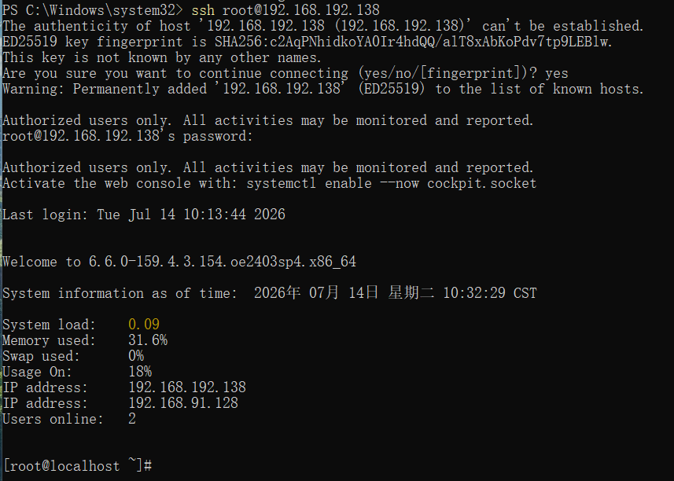
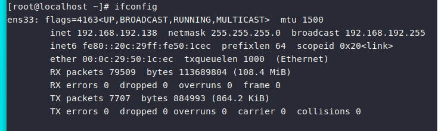
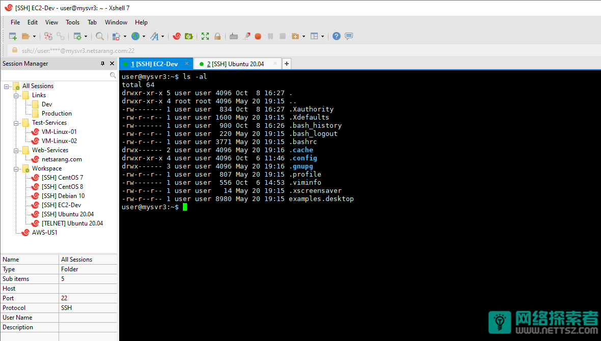
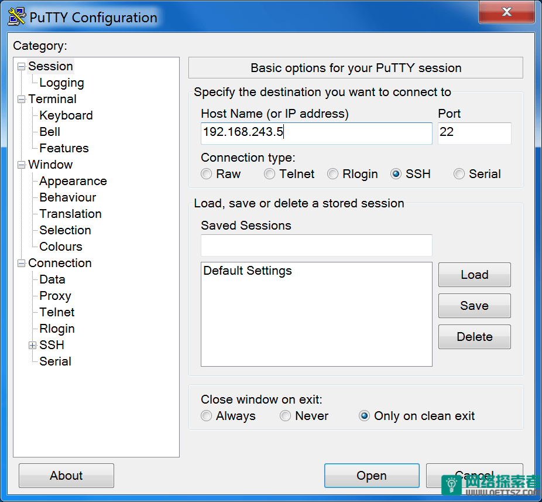

# 第十章 网络管理

## 1.网络设置

自动获取（DHCP）：网卡配置为 BOOTPROTO=dhcp，由局域网里的 DHCP 服务器（路由器或 DHCP 服务）自动分配 IP 地址、网关、DNS、子网掩码。
手动设置（静态 static）：BOOTPROTO=static，自己手动填写 IP、网关、子网掩码、DNS，地址固定不变，服务器必选。

1. 手动设置
方式 1：配置网卡文件
>网卡配置文件 /etc/sysconfig/network‑scripts/ifcfg‑ens33

静态 IP 配置示例
```ini
TYPE=Ethernet
BOOTPROTO=static          # static静态，dhcp自动获取
NAME=ens33
DEVICE=ens33
ONBOOT=yes                # 开机启用网卡
IPADDR=192.168.100.10
NETMASK=255.255.255.0
GATEWAY=192.168.100.2
DNS1=223.5.5.5
DNS2=8.8.8.8
```
重启网卡：
```bash
# CentOS7
systemctl restart network
# openEuler/CentOS8以后用nmcli
nmcli connection reload
nmcli connection up ens33
```
方式 2：nmcli 命令
```bash
# 查看网卡
nmcli device status
# 设置静态ip
nmcli connection modify ens33 ipv4.addresses 192.168.100.10/24 \
ipv4.gateway 192.168.100.2 ipv4.dns "223.5.5.5,8.8.8.8" \
ipv4.method manual connection.autoconnect yes

nmcli connection up ens33
```
2. 自动获取
方式 1：配置网卡
```ini
TYPE=Ethernet
BOOTPROTO=dhcp
NAME=ens33
DEVICE=ens33
ONBOOT=yes
# dhcp模式不需要写IPADDR、GATEWAY、DNS1等参数
```
重启网卡生效：

    CentOS7：systemctl restart network
    openEuler / CentOS‑8/9：

```bash
nmcli connection reload
nmcli connection up ens33
```

方式 2：nmcli 命令设置
```bash
# ipv4.method=auto 代表dhcp自动获取，清空ip网关配置
nmcli connection modify ens33 ipv4.method auto
nmcli connection up ens33
```

查看当前 IP 是否是 DHCP 分配bash运行`nmcli connection show ens33 | grep method`
ipv4.method:         auto  → DHCP自动
ipv4.method:         manual → 手动静态

3. 基础网络排查命令
```bash
ip a                  # 查看网卡ip（替代ifconfig）
route -n              # 查看网关
cat /etc/resolv.conf  # 查看DNS
ping 8.8.8.8          # 测试外网连通
hostname -I           # 只输出本机IP
```


## 2.防火墙firewalld设置

防火墙：拦截的是从网卡进来的外部请求

宿主机 → 虚拟机，属于同网段内网流量，分两种情况：
- 如果你没手动限制内网网段（绝大多数默认配置）
firewalld 默认信任内网虚拟网卡，本机监听的端口对内网不拦截，只拦截公网陌生 IP。
- 手动开放了端口，不代表其他端口全封死

1. 基础查看命令
```bash
# 查看防火墙状态
systemctl status firewalld

# 开机自启设置
systemctl start firewalld
systemctl stop firewalld
systemctl enable firewalld
systemctl disable firewalld

# 查看防火墙规则
firewall-cmd --list-all
```
>两个模式：
runtime：临时生效，重启防火墙失效
permanent：永久生效，执行后必须重载防火墙才生效 --permanent

2. 放行端口（最常用）
```bash
# 永久放行单个端口，例如80端口
firewall-cmd --permanent --add-port=80/tcp

# 放行一段端口 3306‑3310
firewall-cmd --permanent --add-port=3306-3310/tcp

# 重载配置（不加这条修改不会生效）
firewall-cmd --reload

# 删除端口
firewall-cmd --permanent --remove-port=80/tcp
firewall-cmd --reload
```

3. 放行服务（firewalld 内置服务名）
内置服务：http、https、mysql、ssh 等
```bash
# 放行http服务(80端口)
firewall-cmd --permanent --add-service=http
firewall-cmd --reload

# 查看支持的服务列表
firewall-cmd --get-services
```

4. 限定指定 IP 访问（安全常用）
只允许 192.168.1.100 访问服务器 22 端口，其余 IP 拒绝：
```bash
# 先移除全局开放22
firewall-cmd --permanent --remove-port=22/tcp
# 添加富规则 rich‑rule
firewall‑cmd --permanent --add‑rich‑rule="rule family='ipv4' source address='192.168.1.100' port protocol='tcp' port='22' accept"
firewall-cmd --reload
```

5. 区域 zone 概念（firewalld 核心）
zone 优先级：由高到低

>trusted：全部允许
home、work：信任内网
public（默认 zone）：只允许 ssh dhcpv6‑client，其余拒绝
drop：丢弃所有数据包，不回包

```bash
# 查看默认zone
firewall-cmd --get-default-zone
# 修改默认zone为drop（严格模式）
firewall‑cmd --set‑default‑zone=drop --permanent
firewall-cmd --reload
```

## 3.SSH远程登录

### 3.1 SSH 介绍
SSH（Secure Shell），默认端口 22/tcp，用来加密远程登录 Linux 服务器，替代不安全的 telnet。

    客户端：Windows、Linux、macOS；
    服务端：Linux 里面软件叫 openssh‑server。

### 3.2 服务端配置（Linux 服务器上操作）
1）检查是否安装
```bash
rpm -qa | grep openssh-server
```
没安装就安装：
```bash
dnf install openssh-server -y
```

2）启动开机自启
```bash
systemctl start sshd
systemctl enable sshd
systemctl status sshd
```
3）防火墙放行 22 端口
```bash
firewall-cmd --permanent --add-port=22/tcp
firewall-cmd --reload
```
4）修改配置（/etc/ssh/sshd_config）
```bash
vim /etc/ssh/sshd_config
```
常用配置项：
```ini

Port 22222          # 修改ssh端口（生产环境建议改掉默认22）
PermitRootLogin yes # 是否允许root登录，公网服务器建议改成no
PasswordAuthentication yes # 密码登录，密钥登录后这里关闭更安全
```
改完重启 sshd 生效：bash运行`systemctl restart sshd`

### 3.3 客户端连接方式
1. Linux / Mac 自带 ssh 命令
```bash
ssh 用户名@服务器IP -p 端口号
```
示例：
```bash
# 默认22端口可以省略‑p
ssh root@192.168.1.100

# 如果改成22222端口
ssh root@192.168.1.100 -p 22222
```
第一次连接会出现确认：输入 yes，之后输入服务器密码即可登录。

2. Windows 系统连接
- 方案 A：Windows10‑11 自带 OpenSSH

        开启 OpenSSH 客户端：设置 → 应用 → 可选功能，安装 OpenSSH 客户端；
        打开 cmd 或者 PowerShell，命令和 Linux 一模一样：

在powershell里输入

`ssh root@ip地址`


退出输入`exit`即可

虚拟机的IP地址查询
```bash
ifconfig
```


3. 第三方工具（日常运维最常用）

    Xshell、SecureCRT、FinalShell、Putty
    填写：IP、端口、账号密码，图形化操作。

**Xshell**:


Xshell是一款适用于 Windows 的全功能 SSH 客户端软件。能够为每个终端会话设置不同的参数，为多个会话创建通用脚本。

支持 Windows 命令行和 SCP 协议。还具有用于在图形环境中管理文档的内置文件管理器。可以记录你执行的所有命令，并将“记录”的材料变成一个脚本，然后可以随时重新启动。

Xshell是一个强大的 SSH 客户端。允许你直接在 XShell 中打开 Windows CMD命令行界面，此外还提供了一个选项卡式界面。可以显示多个需要同时查看和监控的会话。

**Putty**:



Putty没有添加任何安全功能。但是，如果使用SSH 协议进行连接的话，则可以添加一些安全性。SSH协议将提供身份验证以及加密以保护通过网络进行的连接。此外还支持 SCP、SSH、rlogin 和 Telnet 协议。

Putty还有一些附加的功能，包括保存会话以进行快速访问。但是，最大的缺点在于不能保存远程服务器的登录密码，这主要是因为官方认为保存密码不够安全。

Putty 最初是为 Windows 操作系统开发的，但是最新版本已经可以在包括 UNIX 和 Linux 在内的各种其他类型的操作系统上运行。