# 第十一章 系统监控与故障排除

## 1.系统日志


### 1.1 什么是日志文件
简单来讲，就是记录系统在什么时间，由哪个进程做了什么样的操作时，发生了什么事。


### 1.2 Linux 日志的体系
分为 3 套体系：
- 传统 syslog 日志（rsyslog 服务）：CentOS6 主流，CentOS7‑CentOS9、openEuler 仍然兼容。配置文件/etc/rsyslog.conf，日志文件默认存放在/var/log/。
- journald 日志（systemd‑journald）：CentOS7 以后标配，专门记录 systemd 托管的服务日志，二进制格式，不是普通文本，用journalctl查看。
- 应用自身日志：Nginx、MySQL、Tomcat、程序项目自己输出日志，不归 rsyslog 和 journald 管理。

相关服务：
```bash
systemctl status rsyslog
systemctl status systemd-journald
```

### 1.3 /var/log 目录下各个日志文件

|文件|作用|排查场景|
|---|---|---|
|/var/log/messages|系统通用信息，内核、守护进程、普通服务非错误和错误日志|系统莫名重启、服务启动失败、内核警告。CentOS7 里很多内容迁移到 journald，messages 日志内容变少|
|/var/log/secure|安全认证日志，非常重要。ssh 登录、su 切换用户、sudo 执行、登录失败、密钥认证、密码错误|	ssh 连不上、暴力破解、账号异常登录、sudo 执行失败必查此文件|
|/var/log/cron|crontab 定时任务执行日志|定时任务不执行，脚本执行失败，看这个日志|
|/var/log/dmesg|内核硬件日志；硬盘、CPU、内存、网卡报错、硬件故障、OOM 内核杀进程|服务器突然宕机、网卡丢包、磁盘坏道、内核 OOM 杀死进程|
|/var/log/boot.log|系统开机启动过程输出，各个服务启动打印信息|开机启动失败，开机启动超时|
|/var/log/yum.log|yum 安装卸载软件包记录|排查谁安装或者卸载软件|
|/var/log/maillog|邮件相关日志|服务器发送邮件失败查看|
|/var/log/lastlog|二进制文件，不能 cat 查看；记录所有用户最后登录时间，命令lastlog查看|查看系统账号有没有人登录过|
|/var/log/wtmp|二进制，存放登录历史，命令last查看；所有登录、重启记录|查看服务器什么时候重启、谁登录服务器|
|/var/log/btmp|二进制，记录登录失败记录，命令lastb查看，查看暴力破解次数|	查服务器是否被暴力破解|

>last、lastb、lastlog 都是二进制文件，不能用 cat、vi 打开。

查看命令示例：
```bash
# 筛选ssh登录失败记录
grep "Failed password" /var/log/secure
# 查看所有登录失败记录
lastb
# 查看系统重启历史
last
# 查看所有用户最后登录时间
lastlog
```
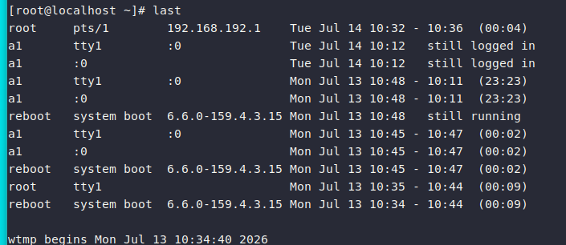
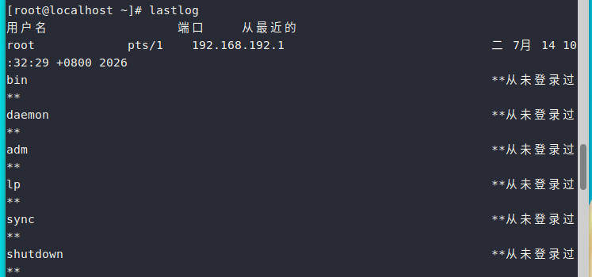

### 1.4 日志文件内容的一般格式

一般来说，每条信息均会记录下面几个重要内容：
  - 时间发生的日期与时间
  - 发生此事件的主机名
  - 启动此事件的服务名称或命令与函数名称
  - 该信息的实际内容

下面是/var/log/secure
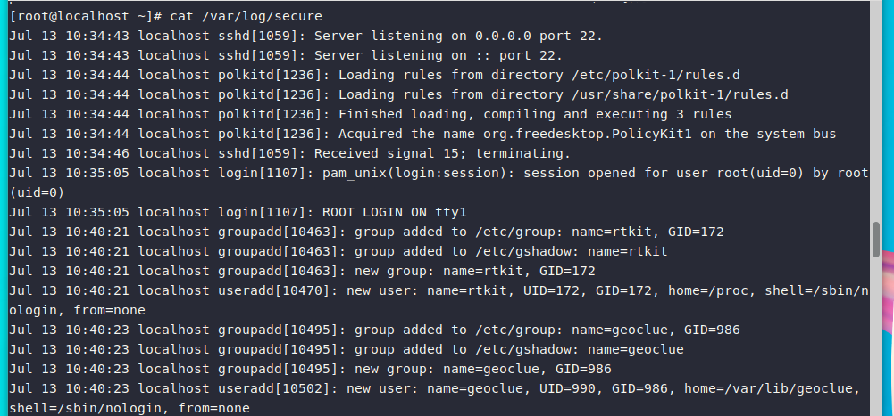

### 1.5 rsyslog 服务

rsyslog的配置文件/etc/rsyslog.conf
这个文件规定了（1）什么服务（2）什么等级（3）需要被记录在哪里
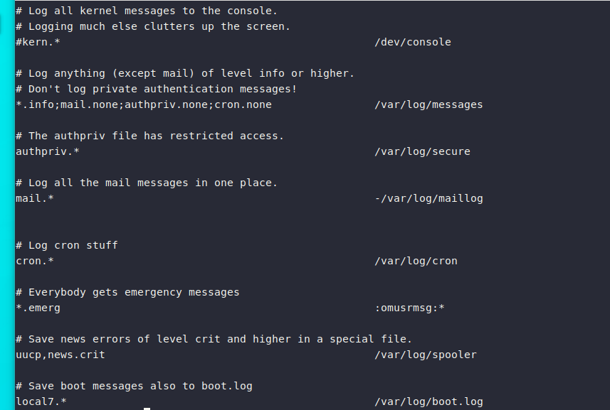

我们将上面数据分成三个部分来说明：

1. 服务名称
    rsyslog主要还是通过Linux内核提供的syslog相关规范来设置数据的分类，syslog支持的服务类型主要有下面这些
    |相对序号|服务类别|说明|
    |---|---|---|
    |0|kern(kernel)|就是内核（kernel）产生的信息，大部分都是硬件检测以及内核功能的启用|
    |1|user|就是在用户层级所产生的信息，例如用户使用logger命令来记录日志文件的功能|
    |2|mail|只要与邮件收发有关的信息记录都属于这个|
    |3|daemon|主要是系统的服务所产生的信息，例如systemd的信息就和这个有关|
    |4|auth|主要有认证/授权有关的机制，例如ssh、su等需要密码的东西|
    |5|syslog|由syslog相关协议产生的信息，其实就是rsyslog这个程序本身的信息|
    |6|lpr|打印相关的信息|
    |7|news|与新闻组服务器相关的信息|
    |8|uucp|全名是UNIX to UNIX Copy Protocol,早期用于UNIX系统间的程序数据交换|
    |9|cron|计划任务cron、at等产生信息记录的地方|
    |10|authpriv|与auth类似，但记录较多账号的私人信息，包括pam模块的运行等|
    |11|ftp|与FTP通讯协议有关的信息输出|
    |16~23|local0~local7|保留给本机用户使用的一些日志文件信息，较常与终端互动|

2. 信息等级
   同一个服务所产生的信息也是有差别的，有启动时仅通知系统而已的一般信息（information），有出现还不至于影响到正常运行的警告信息（warn），还有系统硬件发生严重错误时，所产生的重大问题信息（error）。基本上，Linux内核的syslog将信息分为8个主要的等级。

    |等级数值|等级名称|说明|
    |---|---|---|
    |7|debug|用来展示debug（除错）时产生的数据|
    |6|info|仅是一些基本的信息说明而已|
    |5|notice|虽然是正常信息，但比info还需要被注意到的一些信息|
    |4|warining(warn)|警示的信息，可能有问题，但还不至于影响到某个daemon运行的信息|
    |3|err(error)|一些重大的信息错误，例如配置文件的某些设置值造成该服务无法启动的信息说明|
    |2|crit|比error还严重的错误，crit是临界点critical的缩写|
    |1|alert|警告，已经很有问题的等级，比crit还严重|
    |0|emerg(panic)|疼痛等级，意指系统已经近乎宕机的状态，很严重的错误等级。通常大概只有硬件出问题，导致整个内核无法顺利运行，就会出现这样的等级的信息|
   
基本上，在0到6的等级之间，越靠近0，问题越大。
除此之外还有两个比较特殊的等级debug（错误检测等级）和none（不需登录等级），当我们想做一些错误检测，或是忽略掉某些服务的信息时，就用这两个。

特别留意一下，服务名称和信息等级之间还有.、.=、.!三种连接符号，他们的意思是这样的：
   - . :代表比后面还严重的等级（包含该等级）被记录下来。例如mail.info代表只要是mail的信息，而且该信息等级严重于info（包含info）时，就会被记录下来。
   -  .= ：代表所需要的等级就是后面接的等级，其他的不需要
   -  .! ：代表不等于，意思是除了后面的等级，其他都记录
  
3. 信息记录的文件名或设备或主机

最后就是这个信息被记录在哪里的设置。通常我们使用的都是记录的文件，但是也可以输出到设备，例如打印机之类的，也可以记录到不同的主机上去。下面是一些常见的放置处：
   - 文件的绝对路径：通常就是放在/var/log里的文件
   - 打印机或其他：例如/dev/lp0这个打印机设备
   - 用户名称：显示给用户
   - *：代表目前在线的所有人


了解完这些，我们再来看看默认的rsyslog.conf
   - kern.* ：只要是内核产生的信息，全都送到console去
   - *.info;mail.none;authpriv.none;cron.none ：由于mail、authpriv、cron等类别产生的信息较多，且已经被写入到下面的多个文件中，因此在/var/log/messages里就不记录这些项目，除此之外的信息都写入/var/log/message中
   - authpriv.* ：认证方面的信息均写入/var/log/secure文件
   - cron.* ：计划任务均写入/var/log/cron文件
   - *.emerg ：当产生最严重的错误等级时，将该等级的信息以wall的方式广播给所有系统登录的账号
   - uucp,news.crit ：uucp是早期UNIX-like系统进行数据传递的通讯协议，后来常用在新闻组，news则是新闻组。当新闻组方面的信息有严重错误时就写入/var/log/spooler文件
   - local7.* ：将本机启动时应该显示到屏幕的信息写入/var/log/boot.log文件

在关于mail的记录中，在文件前面还有一个减号（-）是干什么的？
由于邮件产生的信息比较多，因此我们希望邮件产生的信息先储存到速度较快的内存缓冲区中，等数据量够大了再一次性写入磁盘。

### 1.6 日志文件的轮循（logrotate）

问题：日志文件持续增大，如果不切割会占满磁盘。logrotate专门负责日志切割、压缩、删除旧日志。

    配置主文件：/etc/logrotate.conf全局配置
    独立配置：/etc/logrotate.d/目录下，rsyslog、nginx、mysql 各自轮转配置。

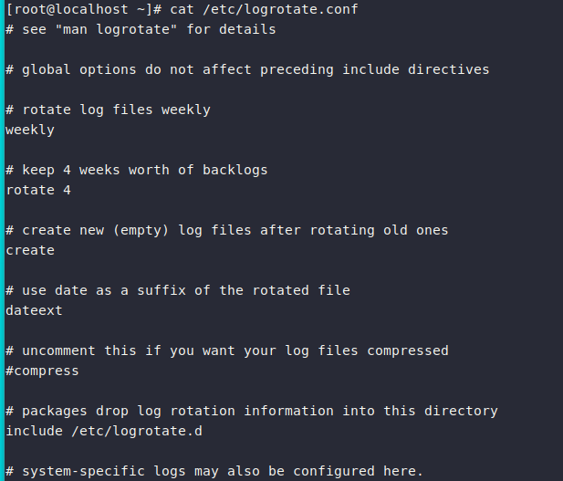
全局配置项解释
```conf

weekly          # 默认一周切割一次
rotate 4        # 保留4份历史日志，超过就删除
create          # 切割之后新建空日志文件
compress        # 旧日志gzip压缩
dateext         # 日志文件添加日期后缀，例如secure‑20260714
```
`/etc/logrotate.d/syslog`：控制 messages、secure、cron 日志轮转策略。
```bash
# 手动强制执行日志切割（测试用）
logrotate -f /etc/logrotate.d/syslog
# 查看logrotate执行日志
cat /var/lib/logrotate/logrotate.status
```

### 1.7 journald
1. journald 特点

   - 日志存放在二进制文件里，不能 cat，只能用journalctl读取；
   - 只记录由 systemd 管理的服务（sshd、firewalld、docker、nginx 等）；
   - 日志可以持久化或者临时存放；
   - 可以按服务、时间、进程 id、日志级别筛选日志，比 rsyslog 更加灵活。

日志存放位置：

临时模式（默认）：`/run/log/journal`，重启日志丢失；
持久模式：`/var/log/journal`，重启日志仍然保留。

开启持久化：修改 /etc/systemd/journald.conf
```ini

Storage=persistent
```
重启 `systemctl restart systemd-journald`。

2. journalctl 高频命令
1）按服务查看日志
```bash
journalctl -u sshd                 # 查看sshd服务全部日志
journalctl -u docker
journalctl -u nginx --since "1 hour ago"   # 最近一小时日志
journalctl -u sshd --since "2026-07-14 09:00:00" --until "2026-07-14 12:00:00"
```

2）按日志级别过滤
```bash
journalctl -p err      # 只看err级别错误日志（3级别）
journalctl -p crit     # 只看严重错误crit级别
# 级别范围：emerg(0) alert(1) crit(2) err(3) warn(4) notice(5) info(6) debug(7)
```

3）本次开机日志、上一次开机日志
```bash
journalctl -b        # 本次开机全部日志
journalctl -b -1      # 查看上一次开机日志，排查上次关机原因
```

4）实时跟踪日志（类似 tail -f）
```bash
journalctl -u sshd -f
```

5）查看 journal 占用磁盘大小，限制日志大小
```bash
journalctl --disk-usage
# 设置日志最大占用8G，修改/etc/systemd/journald.conf
SystemMaxUse=8G
```

6）查看内核日志（等同于 dmesg）
```bash
journalctl -k
```

## 2.性能监控

性能瓶颈只分为 4 大类：CPU、内存、磁盘 IO、网络 IO。
一套排查顺序：先用top、vmstat整体判断瓶颈，再用针对性命令深入定位进程，最后用sar查看历史性能数据。

首先我们需要安装
```bash
dnf install -y sysstat
dnf install -y iotop
```

### 2.1 CPU 监控
1. top
```bash
top
```
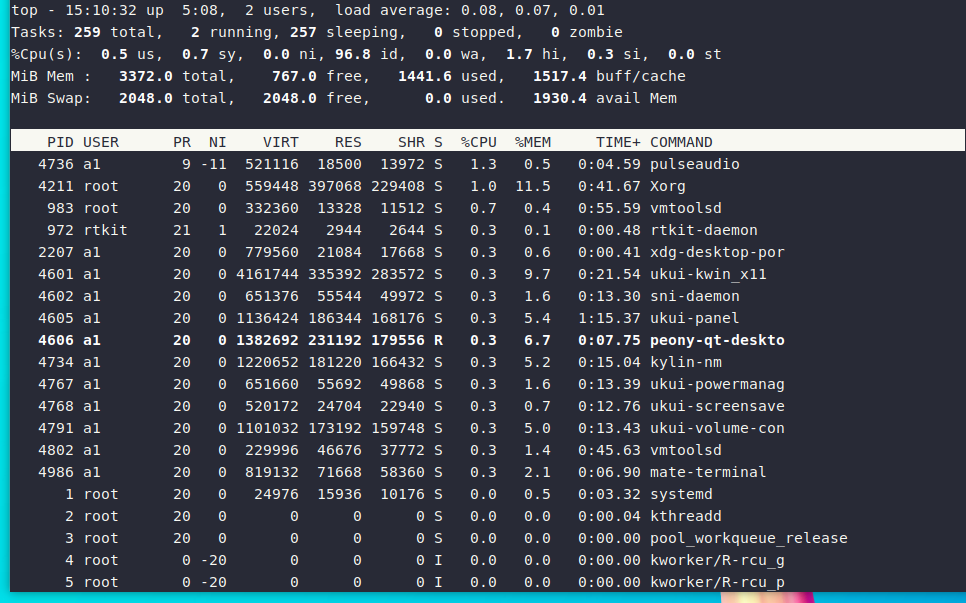
1）全局 CPU 行解析
```plaintext
%Cpu(s):  us, sy, ni, id, wa, hi, si, st
```

|参数|含义|问题判定|
|---|---|---|
|us（user）|用户态 CPU，应用程序消耗（Java、Python 业务进程）|us 很高：业务代码问题，死循环、大量循环计算|
|sy(system)|内核态 CPU，系统内核、系统调用|sy 过高：频繁创建销毁进程、内核 bug、磁盘频繁读写|
|ni|低优先级进程占用|一般数值很小|
|id（idle）|空闲 CPU|id 长期低于 10% 代表 CPU 资源紧张|
|wa（iowait）|等待磁盘 IO 消耗 CPU，进程因为磁盘慢卡住|wa＞30%：磁盘 IO 瓶颈（高频故障）|
|hi|硬中断，网卡、磁盘硬件中断|hi 很高：网卡流量巨大|
|si|软中断|si 偏高：网络收发量大|
|st|被虚拟机抢占 CPU，云服务器专用|st 高说明宿主机资源紧张|

top 交互快捷键

    P：按 CPU 使用率排序；
    M：按内存使用率排序；
    1：展开查看每一颗 CPU 核心；
    f：自定义显示列；
    q：退出。

2）进程列表关键字段
`PID、USER、%CPU、%MEM、COMMAND`
找到高 CPU 的 PID 后：

   - `ps -ef | grep PID`：查看进程对应的程序；
   - `pidstat -t -p PID 2`：查看进程内部线程占用情况。

2. vmstat：系统整体概览（综合工具）
```bash
vmstat 2 10     # 每隔2秒刷新1次，输出10次
```
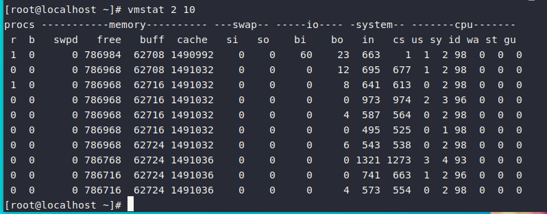
输出字段重点：
```plaintext

procs
 r：就绪队列里等待CPU的进程数；r持续大于CPU核心数 → CPU瓶颈
 b：阻塞进程，大多是等待磁盘IO，b数值高＝磁盘IO压力大

cpu：us,sy,id,wa
swap：si(内存换入磁盘)，so(内存换出到磁盘)
si、so只要不为0＝内存不足，系统在用swap。
```

3. mpstat：查看每个 CPU 核心详细占用
```bash
mpstat -P ALL 2 10
# -P ALL：查看全部CPU；2代表每2秒输出一次;10代表输出10次
```
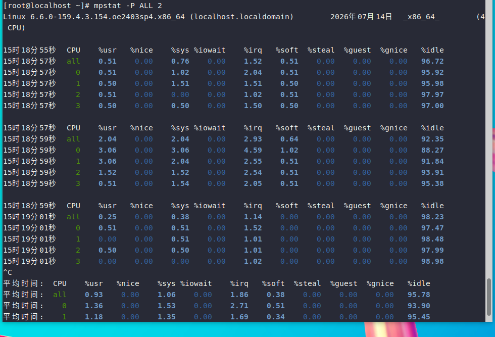

用处：发现单核满载，多核空闲，大概率是程序单线程运行。

4. pidstat：分析进程级别 CPU
```bash
pidstat -u 2          # 每2秒输出进程CPU占用
pidstat -u -p 1234 2 # 只看指定PID
pidstat -t -p 1234 2 # 查看线程CPU占用
```
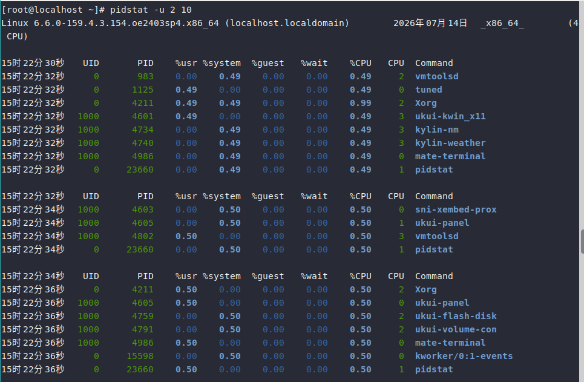

CPU 问题总结

    us 高：业务代码问题；
    sy 高：内核问题；
    wa 高：磁盘瓶颈；
    r＞CPU 核数：CPU 资源不足。

### 2.2 内存监控
1. free -h（查看内存）
```bash
free -h
```
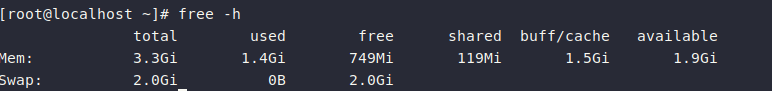

   - used：程序实际占用内存；
   - free：完全空闲内存，Linux 会尽量把空闲内存用作 buff/cache 提升磁盘读写速度；
   - buff/cache：缓冲区和页缓存，内核可回收；
   - **available：真正可用内存**，这个值才是判断内存够不够的标准。
   - Swap：交换分区，一旦 swap 开始大量使用（so 不为 0）＝内存不足。

>Linux 机制：空闲内存优先缓存磁盘数据，free 变小是正常现象，不要以 free 判断内存不足。

2. /proc/meminfo：内存详情
```bash
cat /proc/meminfo
```
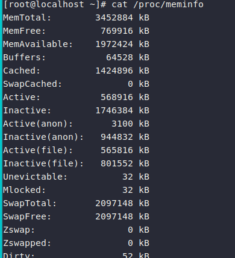
重点看:
   - MemAvailable
   - SwapTotal
   - SwapFree

3. 查找耗内存进程
```bash
ps aux --sort=-%mem     # 按照内存降序排列
pidstat -r 2             # 进程内存占用
```

4. 内存故障场景

1） available 持续很低，swap 大量被占用：应用内存泄漏，程序申请内存用完不释放。
   - Java：jmap查看堆内存；
   - Python：分析代码；
2）内核触发 OOM‑killer：内存耗尽，系统自动杀掉占用内存最高进程。
   - 查看日志：dmesg -T或者journalctl -k搜索 Out‑of‑Memory。
3）手动释放缓存（应急操作，生产不推荐长期执行）：
```bash
echo 3 > /proc/sys/vm/drop_caches
```

### 2.3 磁盘 IO 监控
1. df：磁盘空间使用率
```bash
df -h
```
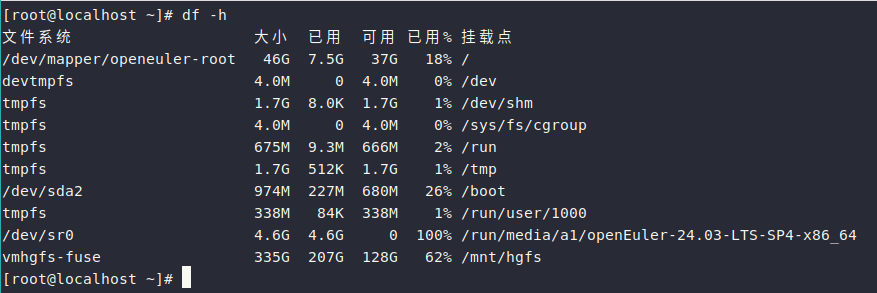
`Use%`接近 100%，日志或者大文件占满磁盘，服务会异常。

查找大文件：
```bash
du -sh /*           # 逐级查找大目录
lsof | grep deleted # 查看被rm删除，但进程还占用的文件（磁盘空间不释放经典问题）
```

2. iostat（磁盘 IO 核心命令）
```bash
iostat -x 2     # -x输出扩展信息，每2秒刷新
```
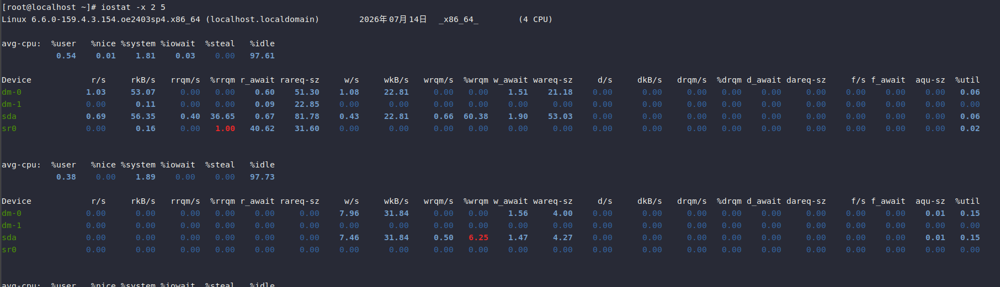
重点字段：

   - `%util`：磁盘设备繁忙百分比；% util＞85‑90% 说明磁盘 IO 瓶颈；
   - `await`：IO 请求平均等待时间 (ms)，数值越大延迟越高；
   - `rMB/s`：每秒读；wMB/s每秒写；
   - `svctm`：磁盘硬件处理 IO 的时间。

判断：

   - % util 很高、await 很高：磁盘压力大；
   - % util 很高，但 await 很低：读写量并不大，是大量细碎 IO（数据库随机写、疯狂打日志）。

3. iotop：定位哪个进程在疯狂读写磁盘
```bash
iotop -oP
# -o：只显示正在产生IO的进程；P只显示进程不显示线程
```
常见造成 IO 过高原因：

    程序疯狂输出日志；
    MySQL 大量随机写入；
    定时备份、日志打包；
    磁盘本身硬件故障。

### 2.4 网络性能监控
1. ss:查看端口连接
```bash
运行

ss -antlp
# 参数：
# a：所有连接；n：数字格式；t：tcp；l：监听端口；p：进程名称
```
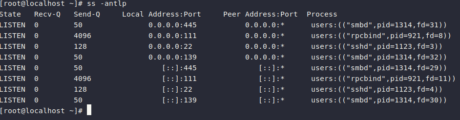
   - LISTEN：监听状态；
   - ESTAB：正在通信的连接；
   - TIME‑WAIT：连接关闭后的等待状态，大量 TIME‑WAIT 会消耗内核资源。

2. sar 查看网卡流量
```bash
sar -n DEV 2
# rxkB/s：接收；txkB/s发送；流量持续跑满网卡上限，网络瓶颈
```
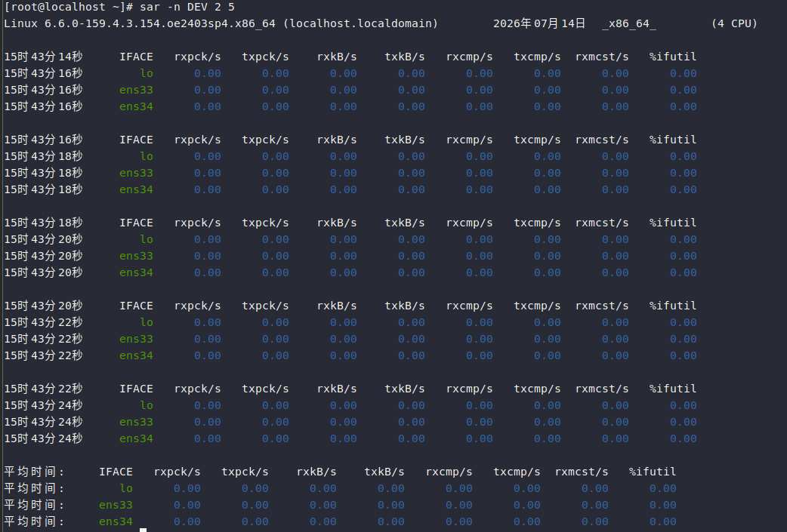

3. 查看 TCP 连接状态统计
```bash
ss -s
# 统计：Total、ESTAB、TIME‑WAIT
```
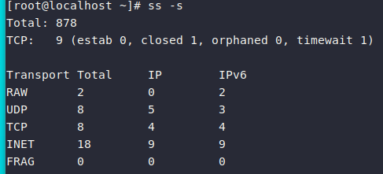
优化内核参数（/etc/sysctl.conf）解决大量 TIME‑WAIT：
```ini
net.ipv4.tcp_tw_reuse = 1
```

4. 抓包分析（tcpdump）
```bash
tcpdump -i ens33 port 8080
```

5. 连通性测试
```bash
ping + 网址
traceroute    # 路由跟踪，判断哪里丢包
mtr           # 实时查看链路丢包率，排查网络延迟神器
```

### 2.5 sar：查看历史性能
前面 top、vmstat 只能看实时状态；sar 可以查看历史性能数据。
系统默认会定时采集性能数据存放在 /var/log/sa/。
用法：
```bash
sar -u 2 10    # CPU实时状态，2秒一次，共10次
sar -r 2       # 内存
sar -d 2       # 磁盘
sar -n DEV 2   # 网络

# 查看14号历史CPU状态
sar -f /var/log/sa/sa14
```

### 2.6 pidstat 全能进程监控
pidstat 可以分别查看 CPU、内存、IO、上下文切换：
```bash
pidstat -u 2    # CPU
pidstat -r 2    # 内存
pidstat -d 2    # 磁盘IO
pidstat -w 2    # 上下文切换，cswch过高：进程频繁切换，CPU压力大
```

## 3.常见的故障排查步骤

先用vmstat做整体判断：
   - r 值高 → CPU 瓶颈；
   - si/so 不为 0 → 内存不足；
   - b 值很高、wa 高 → 磁盘 IO 瓶颈。
  
确定瓶颈后深入排查：
   - CPU：top → pidstat → mpstat找到占用 CPU 高进程；
   - 内存：free -h → ps aux --sort=-%mem → OOM日志；
   - 磁盘 IO：iostat -x → iotop；
   - 网络：ss、sar‑n、mtr；

事后复盘：用sar查看历史数据。

**常见问题判断总结**
- top 里 us 很高：应用程序问题；
- sy 高：内核开销大；
- wa 高：磁盘 IO 瓶颈；
- si 和 so 数值上涨：内存不足；
- % util 很高：磁盘压力大；
- 大量 TIME‑WAIT：内核参数需要优化。