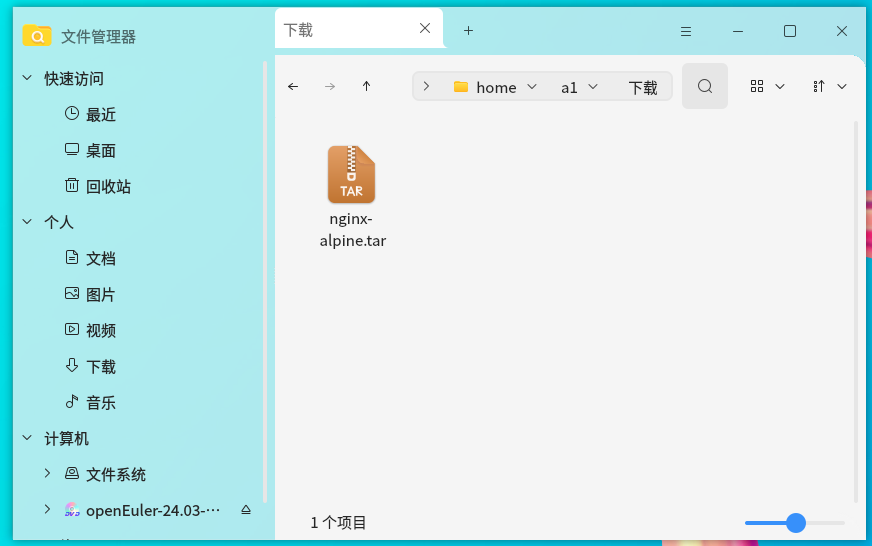
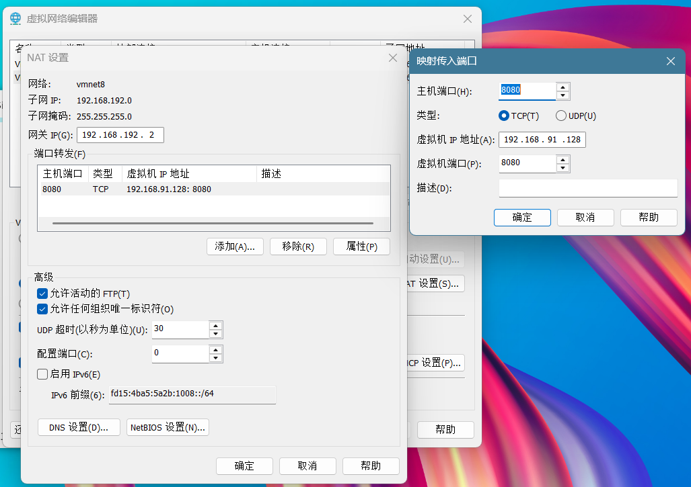
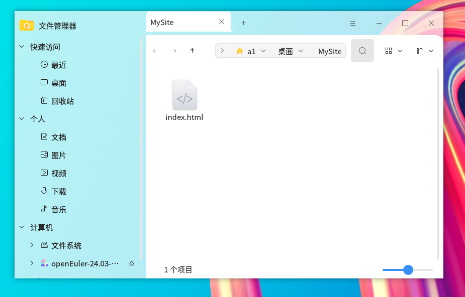

# 第十二章 Web服务器

## 1.Nginx or Apache

### 1.1基础概况

- Apache：老牌 web 服务器，全称 httpd，CentOS 软件包名字叫 httpd。
    采用多进程‑多线程模型，一个连接对应一个线程。

- Nginx：轻量级，事件驱动（epoll）、单进程多异步非阻塞模型。

### 1.2 核心区别
1. 并发能力（最大差异）

   - Apache：每来一个请求就分配 1 个线程，高并发下线程过多，CPU 上下文切换频繁，上万并发性能很差。适合并发量不大的网站。
   - Nginx：异步非阻塞、epoll 模型，一个工作进程可以处理成千上万连接，消耗内存极低；高并发、高连接场景碾压 Apache；互联网公司主流选择。

2. IO 模型

   - Apache：同步阻塞 IO；
   - Nginx：异步非阻塞 IO。

3. 模块扩展

   - Apache：模块加载方式：动态加载 / 静态编译，模块丰富稳定，但开启过多模块臃肿。
   - Nginx：模块编译时添加（默认不支持动态模块，新版 1.9.10 以后支持动态模块），第三方模块少于 Apache。

4. 稳定性

   - Apache：多进程模式，某个线程崩溃只影响当前连接，主进程不受影响，长期运行稳定。
   - Nginx：Worker 进程一旦崩溃该进程下所有连接断开；master 进程依旧正常。只要配置合理稳定性没问题。

5. 功能侧重
- Apache 优点：

    1. .htaccess 目录级配置（虚拟目录权限、防盗链、URL 重写），目录单独配置非常灵活；虚拟主机配置简单。
    2. 对 PHP 解析兼容性更好，搭配 mod_php 模块。
    3. 动态网站老牌首选，老式 PHP‑Apache 架构。

- Nginx 优点：

    1. 反向代理、负载均衡、动静分离、缓存、限流、SSL 性能极强；
    2. 静态文件 (html、图片、js) 处理速度远超 Apache；
    3. 可以做前端代理服务器，后端连接 Apache、Tomcat。

经典架构：Nginx（前端） + Apache/Tomcat（后端）。

6. 资源占用
同样 1000 并发：
   - Apache：占用几百 MB 内存；
   - Nginx：几十 MB 内存。

这章我们的主要目的是部署一个静态网站，所以我们选择Docker + Nginx


### 1.3 Docker + Nginx 与 Linux 原生安装 Nginx 的区别

1） 底层运行机制完全不同
1. 原生 Linux Nginx

   - 直接安装在宿主机系统内，共用宿主机所有系统文件、库、命令、用户
   - 进程是宿主机普通 PID 进程，ps -ef 直接能看到完整进程树
   - 依赖全部来自系统：glibc、openssl、pcre、系统日志、系统用户、systemd 管理
   - 受宿主机全局配置影响：系统防火墙、全局环境变量、系统库版本

2. Docker Nginx

   - 基于操作系统级虚拟化 Namespace+Cgroups
        PID / 网络 / 挂载 / 用户 / 主机名全部隔离；
        容器内是一套独立迷你文件系统（镜像自带 nginx、依赖库）；
   - 容器只是一组受限进程，宿主机内核共享，但不共用宿主机软件、库、配置文件；
   - 自带独立运行环境，和宿主机软件版本完全隔离。

2） 文件、配置、日志差异
1. 安装与文件路径
   - 原生安装

         程序：/usr/sbin/nginx
         配置：/etc/nginx/
         网站根目录：/usr/share/nginx/html
         日志：/var/log/nginx/
         所有文件永久存在宿主机磁盘，系统重装才丢失

   - Docker 容器

         容器内部路径和原生一致，但容器删除内部文件全部丢失；
         配置、静态页面、日志必须通过 -v 宿主机目录:容器目录 数据卷挂载持久化；
         不挂载卷的情况下，修改配置 / 页面重启容器直接复原。

2. 依赖隔离
   - 原生：
系统只能存在一个 nginx 版本，升级会影响所有业务；安装其他软件可能覆盖 openssl/pcre 依赖，导致 nginx 崩溃。
   - Docker：
宿主机无需安装 nginx、无需装依赖；
可同时运行多版本 Nginx（1.20、1.24、1.26）互不冲突，每个容器自带全套依赖库。

3） 网络模式差异
- 原生 Nginx

      直接监听宿主机网卡端口（80/443）；
      端口被系统其他服务占用就无法启动；
      防火墙直接拦截宿主机端口。

- Docker Nginx 

      端口映射（默认 bridge）
      docker run -p 8080:80 nginx
      容器内部 80，宿主机对外 8080；一台机器可启动多个 nginx，映射不同宿主机端口，不会端口冲突。

4） 进程管理、启停方式
- 原生
由 systemd/systemctl 管理：
```bash
systemctl start/stop/restart nginx
systemctl enable nginx
nginx -s reload
```
随服务器开机自启，进程常驻系统，故障需手动排查、重启。

- Docker Nginx
由 docker 引擎管理：
```bash
docker run / docker stop / docker restart
# 平滑重载配置
docker exec nginx nginx -s reload
```
   - 支持容器健康检查、自动重启、一键删除重建；
   - 不用修改系统服务，不污染 systemd 服务列表；
   - 迁移服务器：一条 run 命令即可重建环境，无需重装、复制依赖。

5） 环境一致性与部署效率
- 原生
每台服务器都要执行 yum install /apt install，手动改配置、上传页面；
不同系统（CentOS7 /openEuler/ Ubuntu）软件版本、文件路径存在差异，环境不一致，容易出现 “本地能跑线上不行”。
- Docker
镜像统一打包 nginx + 依赖 + 基础配置；
任意装有 Docker 的机器，拉取镜像直接运行，环境 100% 一致；
CI/CD 流水线、批量云服务器一键部署，适合微服务集群。

6） 安全隔离
- 原生
nginx 进程拥有宿主机完整文件读取权限，一旦 nginx 漏洞被入侵，攻击者可读取宿主机所有系统文件、其他业务数据。
- Docker 容器隔离
默认容器内用户权限受限；
配合挂载只读目录、cap 权限裁剪，入侵后只能访问容器内挂载的页面 / 配置，无法直接操作宿主机系统目录，风险范围更小。

## 2.前期准备

### 2.1 安装docker
```bash
dnf install -y docker
systemctl start docker
```
可以用
```bash
docker --version
```
来查看有没有安装成功

### 2.2 导入nginx镜像
如果网络允许的话，可以直接从外网下载nginx

```bash
docker pull nginx
```
如果网络不允许，需要导入nginx的镜像包

cd到导入的目录下,再运行
```bash
sudo docker load -i nginx-alpine.tar
```
我这里导入到了/home/a1/下载，

```bash
cd /home/a1/下载
sudo docker load -i nginx-alpine.tar
```

完成后可以用
```bash
docker images
```
来查看有没有导入成功


### 2.3 设置网络和防火墙
1）如果虚拟机网络用的是桥接模式，可以不用设置端口转发。
如果虚拟机网络用的是NAT模式，需要设置端口转发：让外部设备通过指定端口访问内网设备服务的技术


>需要注意的是，如果用的是DHCP，每一次启动虚拟机，DHCP都会分配不同的IP地址，端口转发处的IP地址也需要对应更换。不想更换的可以参考前面的内容，设置静态IP

2）告诉Windows 防火墙：允许外部访问主机的 8080 端口，否则端口转发就没法生效。
以管理员身份运行windows的powershell，并输入如下命令
```bash
netsh advfirewall firewall add rule name="Kali8080" dir=in action=allow protocol=TCP localport=8080
```
3）同时让openeuler放行8080端口
```bash
sudo firewall-cmd --add-port=8080/tcp --permanent
sudo firewall-cmd --reload
```

4） docker端口映射和vmware NAT端口转发的区别
|对比维度|Docker -p 端口映射|VMware NAT 端口转发|
|---|---|---|
|生效位置|Linux 虚拟机内部内核|Windows/mac 物理机的 VMware 软件|
|隔离对象|容器（进程级隔离）|整台虚拟机（硬件级虚拟化隔离）|
|适用访问者|仅虚拟机内部能直接访问容器端口|局域网所有电脑，通过物理机 IP 访问虚拟机|
|网络网段|容器内网（如 172.17.0.x）|VMnet8 虚拟机网段（如 192.168.159.x）|
|不配置转发的后果|虚拟机本机无法访问容器|服务局域网其他电脑无法访问虚拟机所有服务|
|多套转发叠加|必须配合 VMware 转发，外网才能访问容器|外层转发，可转发虚拟机原生服务 + 容器服务|
|关闭服务失效方式|停止容器映射自动消失|删除 VMware 规则、关闭软件才失效|
|依赖条件|虚拟机必须安装 docker|物理机安装 VMware，网络设为 NAT 模式|

### 2.4 准备一个静态网站
创建一个工程文件夹，在里头写一个网站的html文件

我的是在/home/a1/桌面/MySite下的index.html


## 3.部署静态网站
所有准备工作做好之后，打开终端，输入
```bash
docker run -d \
--name mysite \
-p 8080:80 \
-v /home/a1/桌面/MySite:/usr/share/nginx/html \
nginx:alpine
```
启动服务

### 3.1 代码详解
docker run：Docker 创建并启动一个新容器。

\：shell 里的换行符，只是为了命令分行写，便于阅读，一行写完可以去掉反斜杠。
下面逐个参数拆解：
1. -d
全称：--detach
   - 含义：后台守护模式运行容器
   - 作用：容器启动后放到后台运行，终端不会被占用；
    如果去掉 -d，nginx 日志会直接输出在终端，关闭终端网站就停止，生产环境必加 -d。

2. --name mysite
    --name：给容器自定义名称，如果不指定，docker 会随机生成名字。
    mysite：你的容器名字，之后所有操作（停止、重启、查看日志）都用这个名字，例如：
```bash
    docker stop mysite
    docker restart mysite。
```
    注意：同一个名字只能有一个容器，再次执行 run 命令会报错，必须先docker rm -f mysite删除旧容器。

3. -p 8080:80（端口映射）
格式：宿主机端口:容器内部端口

   - 后面的 80：是 nginx‑alpine 容器内部 Nginx 服务默认监听端口（Nginx 默认固定 80 端口，不能改）；
   - 前面的 8080：你的 openEuler 虚拟机对外开放的端口；

数据访问流向：
Windows 浏览器 → VMware NAT 端口转发 (8080) → openEuler 虚拟机的 8080 端口 → 容器内部的 80 端口 → Nginx 服务。

        容器内部端口：80（固定写死）；
        openEuler 虚拟机端口：8080；
        Windows 访问端口：8080（VM‑NAT 映射的端口）。

4. -v /home/a1/桌面/MySite:/usr/share/nginx/html（数据挂载）
   
    - -v = volume 数据卷挂载，
    格式：宿主机目录:容器内目录

    - 宿主机目录：/home/a1/桌面/MySite
    openEuler 虚拟机里存放网页的文件夹，index.html就放在这里，是物理真实目录；
    - 容器内目录：/usr/share/nginx/html
    nginx‑alpine 镜像默认读取网页的目录，Nginx 只会读取这个路径下的 html 文件；

挂载的特点：

   - 双向实时同步：你在 /home/a1/桌面/MySite 修改、新增网页文件，容器里立刻生效，不需要重启 docker 容器；
   - 容器删除后（docker rm mysite），容器内部文件全部清空，但是宿主机MySite文件夹和你的网页文件完全保留，不会丢失；
   - 权限问题：容器里 nginx 运行用户 uid=101，如果宿主机文件夹权限不足，就会出现 403 Forbidden，也就是你刚才遇到的问题。

5. nginx:alpine（最后一个参数：镜像名称）

    - nginx：镜像名字；
    - alpine：镜像标签，基于 alpine‑Linux（极简版 Linux）；
    - 对比：普通 nginx 镜像几百 MB，nginx:alpine只有二三十 M，体积小漏洞更少，非常适合部署静态网站；

如果你是离线导入镜像，docker images查看镜像名字标签必须和这里一致，不然会报错找不到镜像。

>启动完服务之后，主机在浏览器输入localhost:8080，即可访问网页
其他人想要访问需要输入虚拟机IP + :8080


## 4.KVM、Docker、VMware 三大虚拟化技术

### 一、基础定义与底层理论
1. VMware（硬件虚拟化 / 完整虚拟机，Type1/Type2 hypervisor）
核心理论：全虚拟化（Hardware Virtualization）

   分层：宿主机硬件 → Hypervisor 层 → 完整客户操作系统
   两种形态：
      
   - Type2（桌面版：VMware Workstation）：运行在 Windows/macOS 之上，宿主 OS 先启动，再加载虚拟化层；
   - Type1（服务器版：ESXi）：裸金属 Hypervisor，直接跑在物理硬件上，无宿主操作系统。
    
   **原理**：依靠 CPU 硬件虚拟化指令（Intel VT-x / AMD-V），完整模拟一套独立硬件（CPU、内存、显卡、磁盘、网卡 BIOS），每台虚拟机拥有独立内核、驱动、完整操作系统。
  

1. KVM（Linux 内核级硬件虚拟化，Type1/Type2 开源 Hypervisor）
核心理论：内核内置硬件虚拟化，属于全虚拟化

   KVM 不是独立软件，是Linux 内核模块（kvm.ko），把 Linux 内核直接变成 Type2 Hypervisor；搭配 QEMU 做硬件模拟。
   **原理**：
   - 加载 kvm 模块后，Linux 内核获得虚拟机调度能力；
   - QEMU 负责模拟磁盘、网卡、显卡等虚拟硬件；
   - 虚拟机使用硬件 VT-x/AMD-V 指令，CPU 直接分区执行客户机指令。
    
   架构：物理硬件 → Linux 宿主内核 (KVM) → QEMU 硬件模拟 → 独立客户 OS；

3. Docker（容器，操作系统级虚拟化，OS Virtualization）
核心理论：内核共享容器化，进程级隔离

   底层不模拟硬件，所有容器共用宿主机 Linux 内核，不独立操作系统内核；
   
   隔离手段（Linux 内核原生能力）：
   - Namespace：隔离 PID、网络、挂载、用户、主机名；
   - Cgroups：限制 CPU、内存、磁盘 IO、网络带宽资源；
   - UnionFS（镜像分层）：实现容器只读镜像 + 可写层，轻量化分发；
   
   本质：容器只是一组受限制的进程，不是独立虚拟机；
   限制：只能跑和宿主机同内核架构的程序（Linux 宿主机只能跑 Linux 容器，不能跑 Windows）。

### 二、核心对比

|对比维度|VMware|KVM|Docker|
|---|---|---|---|
|虚拟化层级|硬件级全虚拟化|硬件级全虚拟化|操作系统内核级（容器）|
|是否独立内核|每台 VM 独立内核|每台虚拟机独立内核|所有容器共享宿主机内核|
|资源开销|极高，完整 OS 占用内存 / 磁盘|中高，略低于 VMware|极低，仅业务进程占用资源|
|启动速度|分钟级（完整 OS 开机）|几十秒级|毫秒 / 秒级（进程启动）|
|镜像大小|GB 级（完整系统镜像）|GB 级（完整系统）|MB 级（仅应用 + 依赖）|
|隔离强度|最强，硬件隔离，内核互不影响|强，硬件隔离|中等，内核共享，存在内核层安全风险|
|是否跨系统运行|可同时跑 Windows/Linux 虚拟机|可同时跑 Windows/Linux 虚拟机|宿主机 Linux 仅 Linux 容器；Windows 容器需特殊内核|
|底层依赖|CPU VT-x/AMD-V 硬件虚拟化|CPU VT-x/AMD-V|仅 Linux 内核 Namespace/Cgroups，无需硬件虚拟化|
|典型场景|桌面多系统、企业私有云商业虚拟化|云服务器、OpenStack、自建虚拟化集群|微服务、CI/CD、云原生、批量部署应用|
|存储机制|完整虚拟磁盘 vmdk|qcow2 虚拟磁盘|分层联合文件系统 UnionFS|


### 三、关键本质区别
1. **隔离逻辑差异**

   - VMware / KVM：分割硬件
    把一台物理机切分成多台 “虚拟电脑”，每台都有 BIOS、驱动、完整 OS。
    优势：彻底隔离，虚拟机崩溃不会影响宿主机；
    劣势：重复加载系统内核、驱动，资源浪费大。
    
   - Docker：分割操作系统资源
    只切割文件、网络、进程、资源配额，内核共用。
    优势：轻量、秒启动、资源利用率极高；
    劣势：一旦宿主机内核漏洞，所有容器都会受攻击；无法运行异构系统。

2. 性能差距

   KVM > VMware（同硬件下 KVM 损耗更低，开源无商业层冗余）；
   Docker 远优于两者，几乎接近原生物理进程性能，无操作系统启动开销。

